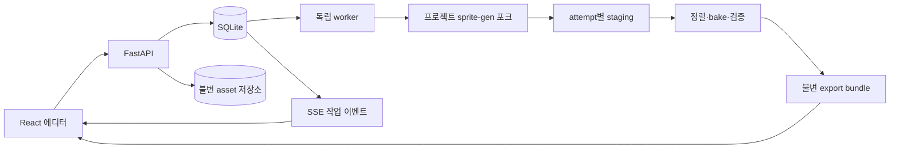

# 기술 설계

> 2026-10-06 자료 정리: 아래 조사·실험의 원본, 비교 결과와 전용 스크립트는 사용자 요청으로 삭제했다. 제품 결정·구현 기록은 보존하며 과거 경로를 현재 실행 가능한 자료로 해석하지 않는다.

버전 1.0 · 구현 기준 · 원작 내부 구조 설명이 아닌 새 제품 설계

## 1. 확정 구성

**React + Vite + TypeScript / FastAPI / SQLite / 독립 Python worker**를 사용한다. 완성 UI 정적 파일은 FastAPI가 같은 origin에서 제공한다. 개발 시 Vite proxy로 `/v1`을 연결한다. 첫 버전은 로컬 단일 사용자·단일 worker이며 요청 수명과 이미지 처리 수명을 분리한다.

Next.js도 가능하지만 이 제품은 로컬 편집 캔버스가 중심이고 SSR 요구가 없다. Python 엔진이 필수이므로 Node BFF를 추가할 이유가 작다. 이 선택은 사용자에게 허용받은 React/Next.js 범위 안의 구현 결정이다. 계정·원격 협업 요구가 실제로 생길 때 재평가한다. 프레임워크 세부 버전은 구현 시 호환 버전을 확인하고 lockfile로 고정한다.

## 2. 엔진 기준과 폴더

검증된 upstream은 `v2.12.1`, commit `b058341f7543f3adcbea227bd4e6b7587895b1bc`다. 설치본의 릴리스 파일 360개가 해당 소스와 일치했다. baseline.json (리서치 정리로 삭제)에 비교 범위가 있다. 연구 당시 main은2.18.0이지만 전체 구현을 감사하지 않았으므로 처음부터 main을 따라가지 않는다.

```text
copy_spritegen/
  apps/web/                  React 화면·canvas·API client·독립 출력 뷰어
  services/api/              FastAPI·schema·프로젝트/asset/revision/job API
  services/worker/           SQLite dispatcher·process runner·checkpoint
  adapters/spritegen/        허용 CLI/함수·ID mapping·materialization
  alignment/                scale·anchor·overflow·deterministic outline
  packages/contracts/       OpenAPI/JSON Schema·생성 TS 타입
  engine/sprite-gen/         고정 upstream 소스+최소 포크 수정·전용 .venv
  engine/engine-lock.json    upstream commit·archive hash·patch/dependency 정보
  tests/fixtures/            자체/사용 허가된 이미지와 합성 반례
  tests/integration/         pipeline·save·jobs·export 회귀
  tests/e2e/                 실제 브라우저 제작 여정
  scripts/                  설치·실행·환경 검사 도구
  .data/                    로컬 프로젝트·asset·job·export, Git 제외
  docs/product/             이 문서 집합
  research/                 원본 조사 보존
```

`engine/sprite-gen`은 독립 소스 포크로 시작한다. 연구가 보존한 upstream tarball도 원본 hash를 검증해 사용할 수 있다. 공용 `~/.codex/skills/sprite-gen`에서 import하지 않고 전용 venv의 editable install을 사용한다. `LICENSE`, `NOTICE`, 저작권 고지, 수정 사항을 보존한다. source pin과 프로젝트 lock을 기록한 뒤 제품용 복사본만 수정한다. 원격 fork/push/PR은 자동으로 수행하지 않는다.

## 3. 책임 경계



API가 프로젝트 revision과 asset 참조의 정본을 소유한다. 엔진 run은 snapshot에서 생성한 작업 사본이다. 사용자가 engine JSON을 직접 수정하지 않는다. 기존 큐레이션의 bake·변형·픽셀 편집 로직은 재사용하지만 저장/출력 요청은 앱 API와 revision 계약을 통과한다. 기존 웹뷰를 임시 통합할 수 있어도 최종 흐름이 여러 독립 run으로 분리되거나 저장 실패를 숨겨서는 안 된다.

## 4. 단계별 재사용

| 단계 | 재사용 | 필수 보완 |
| --- | --- | --- |
| 기준/요청 | prepare·guide·prompt 작성 | identity/style 역할, 승인 revision, 지원 옵션 전달 검증 |
| 생성 | 명시 provider의 gen/gen-set | 웹 설정·작업 관리·부분 생성 lineage·지원 capability |
| 배경 제거 | 균일 배경 cutout·chroma | 실제 알파 검사, 한계 표시, 원본 보존·수동 mask |
| 분리 | component/projection 추출 | resize/fit **이전** crop·좌표·변환을 반환하는 포크 hook |
| 가져오기 | 같은 셀 PNG unpack-atlas | 가변 크기 입력은 먼저 앱 정렬, 자동 중앙배치를 발 정렬로 오인하지 않음 |
| 정렬 | 기존 측정 보조 | 공통 scale·수동 anchor·공중 offset·overflow gate 신규 |
| 편집 | curation state/clone/transform/pixel bake | 안정 ID/occurrence 매핑, 빈 선택 차단, base 원본 보호, save ACK |
| 재생/출력 | compose-atlas·호환 serializer | duration의 명시적 지원, 고정 bake, 최종 atlas에서 PNG 추출, 단일 묶음 publication |
| outline | 새 deterministic renderer | 기존 pixel outline과 별개, 4/8방향·단위·alpha·padding 검증 |

`slice-sheet`는 애니메이션 기본 경로에서 호출하지 않는다. 이미 정규화된 출력만으로 원래 체형을 복원했다고 주장하지 않는다. `extract`의 기존 fit도 검사 없이 통과시키지 않는다. 자동 heal이 원본 프레임을 바꿀 수 있는 compose는 고정된 run 사본에서만 실행한다.

## 5. 작업 실행과 재시작

POST는 검증 후 `202 jobId`를 반환한다. SQLite transaction으로 job을 등록하고 단일 worker가 lease를 얻는다. 하나의 run에는 writer 하나만 허용한다. 엔진 subprocess는 argv 배열과 고정 allowlist로 실행한다. 프롬프트·경로를 셸 문자열로 평가하지 않는다.

job마다 inputRevision, referenceRevision, 입력 hashes, engine/adapter version을 고정하고 attempt별 work 디렉터리를 사용한다. 성공 단계는 입력 fingerprint와 출력 hashes를 checkpoint로 기록한다. 단계 결과 파일을 검증하기 전에는 완료로 표시하지 않는다. SSE 이벤트는 영구 eventSeq로 재연결하며 누락 시 GET 상태로 복원한다.

생성 adapter는 provider를 항상 명시하고 초기 `gen-set` 동시성도1로 명시한다(기존 기본6에 맡기지 않음). 엔진의 Codex timeout 자동 재시도1회는 앱의 외부 접수 불명 정책과 충돌할 수 있으므로 포크에서 끄거나 receipt로 안전성이 확인된 경우에만 재시도하도록 바꾼다. 외부 worker만 조심하고 내부 재시도를 그대로 두면 중복 방지 수용 기준을 충족하지 못한다. provider billing route는 capability의 고정 정보와 인증 상태를 분리하며, API 키 부재 때문에 OpenAI 호출을 구독 경로라고 표시하지 않는다.

취소는 먼저 DB에 기록하고 process group을 종료·수거한 뒤 local 상태를 확정한다. provider 접수 결과가 불분명하면 `provider_outcome_unknown`을 유지하고 자동 생성 재시도를 막는다. 재시작 시 살아 있는 lease/child 여부를 확인하고 stale running을 `interrupted`로 복구한다. 완료된 로컬 단계는 같은 입력 hash일 때만 재사용한다. 최종 상태와 재시도 규칙은 [데이터/API 설계](DATA_API_SPEC.md)가 정본이다.

## 6. 저장과 출력

원본 파일은 content-addressed immutable asset으로 저장한다. 기준 편집도 새 derived asset/reference revision을 만든다. working base의 변화가 원본에 반영되지 않게 한다. asset 파일 write·fsync·atomic rename 후 DB transaction에서 참조를 게시한다. 실패한 임시 파일은 복구 대상이며 이미 게시된 참조 파일을 자동 삭제하지 않는다.

확정 출력은 저장 ACK를 받은 project revision을 잠근다. 동일 snapshot을 한 번 bake하고 그 bitmap/manifest로 최종 미리보기·아틀라스·개별 PNG·호환 JSON을 만든다. 개별 PNG는 기존 export-pngs의 기본 후보 전체 출력에 의존하지 않는다. 결과 폴더를 staging에서 검증 후 rename하고 DB에서 다운로드 가능 상태로 만든다. 파일 게시와 DB commit 사이 중단은 복구 시 hash를 확인하며 미완성 묶음을 노출하지 않는다.

## 7. 로컬 운영과 입력 제한

서버 기본 bind는127.0.0.1, 단일 origin, 로컬 앱 session token을 사용한다. API는 opaque asset/project ID를 받고 임의 경로나 셸을 받지 않는다. `.data` 밖 접근, symlink escape, ZIP path traversal을 차단한다. provider secret은 서버에서만 사용하고 project backup·SSE·로그·브라우저 응답에 포함하지 않는다.

초기 입력 한도는 이미지당32MiB·8192×8192 이하·64M decoded pixels 이하, batch128파일, ZIP256MiB compressed/1GiB unpacked/2048항목으로 검증한다. 이 값은 새 제품 설계값이며 provider 제한과 다르면 더 엄격한 조건과 이유를 UI에 표시한다. 거절된 입력은 기존 프로젝트에 부분 반영하지 않는다. 부하 검사에서 조정할 경우 API/UI/테스트를 함께 갱신한다.

앱 시작기는 환경 검사, API/worker 실행, 브라우저 열기를 제공하고 의존성 누락은 조치 가능한 오류로 표시한다. 이미지 MVP에 필요 없는 `img2webp` 누락을 전체 실행 차단으로 쓰지 않는다. 깨끗한 환경의 실행 검증과 빌드 lockfile이 최종 핸드오프 산출물이다.

## 8. 변경 전략

초기 검증은 실제 연구 fixture를 로컬 회귀에 사용하되 제품 배포 fixture는 자체/사용 허가 소재로 분리한다. upstream 업그레이드는 pre-fit geometry·curation·timing·export 회귀 후 별도 결정으로 남긴다. 연구 source pin을 조용히 최신으로 바꾸지 않는다. 앱 구현 중 필요한 작은 계약 변경은 관련 문서·테스트·결정 기록을 같이 갱신한다.
