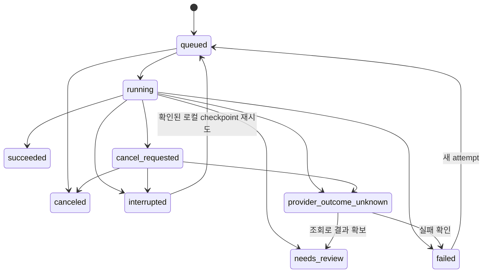

# 데이터·API 계약

버전 1.0 · **새 앱 계약의 정본**. 기존 엔진이 이미 지원하는 API/필드라는 의미가 아니다.

## 1. 식별자와 정본

모든 공개 ID는 UUID 기반 opaque string이다. 숫자 engine candidate index나 파일명은 앱 ID가 아니다. project revision은 프로젝트별 단조 증가 정수이며 `schemaVersion`과 다르다. JSON camelCase, UTC ISO8601 timestamp를 사용하고 UI는 사용자 시간대로 표시한다.

| 엔터티 | 핵심 필드 | 불변/변경 정책 |
| --- | --- | --- |
| Project | projectId, schemaVersion, revision, name, characterIds, activeCharacterId | expectedRevision으로 갱신. 성공 ACK에 savedRevision 반환 |
| Asset | assetId, sha256, decodedHash, originalFilename, mediaType, width, height, storageKey, alphaStats, provenance | bytes 불변. storageKey는 서버 내부 상대 경로. 원본/생성/파생 구분 |
| Character | characterId, name, referenceRevisionId, alignmentGroupIds, clipIds | 참조 변경은 새 revision 채택 |
| ReferenceRevision | referenceRevisionId, identityAssetId, styleAssetIds, poseAssetIds, fixedTraits, allowedChanges, forbiddenTransfers, facing, bodyMeasurement, approval | draft는 새 project revision으로 편집, approved는 불변. 변경 시 새 ID |
| GenerationVersion | generationVersionId, jobId, referenceRevisionId, requestSnapshot, promptHash, providerId, model, receipt, rawAssetIds | 새 생성 요청마다 새 ID. 실제 반환 수와 요청 수 별도 기록, secret 제외 |
| FrameVersion | frameId, frameVersionId, parentFrameVersionId?, generationVersionId?, rawAssetId, imageAssetId, sourceRect, sourceToFrameTransform, extractionVersion, nativeScaleGroupId, review | frameId는 논리 lineage. imageAssetId는 해당 버전의 불변 crop/처리 픽셀. 새 픽셀/재생성은 새 frameVersionId |
| AlignmentGroup | alignmentGroupId, groupRevisionId, referenceRevisionId, frameVersionIds, mode, bodyMeasurement, sharedScale, cell, targetAnchor, resampler, roundingVersion | 같은 원본 배율을 검수한 그룹. group scale 변경은 모든 관련 포즈 새 revision |
| FrameAlignment | frameVersionId, groupRevisionId, sourceAnchor, anchorSpace, method, contactMode, rootAnchor?, authoredOffsetPx, residual, approval | 원본/crop/cell 좌표 명시. 픽셀 버전 바뀌면 기존 승인 자동 적용 금지 |
| ClipRevision | clipId, clipRevisionId, referenceRevisionId, stateId, facing, loop, endBehavior, defaultFps, occurrences | 순서·시간·사용 기준의 정본. 빈 occurrences는 유효 편집 상태, 출력 불가 |
| Occurrence | occurrenceId, frameVersionId, durationMs, timingMode, transform, pixelEditRevision | 같은 frameVersion 여러 번 참조 가능. clone별 offset/time 독립 |
| Job / Attempt | jobId, operation, status, inputRevision, idempotencyKey, requestHash, attemptId, step, eventSeq, lease, checkpoints, errors, artifacts | input snapshot 불변, 실행 기록 append. 재시도는 새 attempt |
| ExportSnapshot | exportId, projectRevision, clipRevisionIds, engineCommit, adapterVersion, renderRecipeHash, files, qaStatus | 검증·게시 후 불변. 같은 export에 다른 revision 섞지 않음 |

Edit journal에는 revision, parentRevision, typed changes, affectedIds를 남긴다. undo/redo 및 과거 복원은 새 revision을 만드는 작업이다. 사용자 원본과 성공한 과거 출력은 덮어쓰지 않는다.

## 2. 정렬과 좌표

좌표 원점은 좌상단, x는 오른쪽·y는 아래쪽이다. rect는 `{x,y,width,height}`, 오른쪽/아래 경계 exclusive다. alpha≥16은 거너 측정 임계값이며 출력 잘림 검사에는 **alpha>0 전체**를 쓴다.

```text
anchorLocal = inverseCropMapping(anchorRaw)
sharedScale = targetBodyHeight / approvedBodyHeight
placementFloat = targetAnchor - sharedScale * anchorLocal + authoredOffsetPx
placementPixel = floor(placementFloat + 0.5)
residual = placementPixel - placementFloat
```

crop 이전 resize가 있으면 `sourceToFrameTransform`을 저장한다. 변환을 모르면 `nativeScaleUnverified`로 검수하고 자동으로 같은 scale group에 넣지 않는다. 체고는 승인된 몸의 두 landmark 차이이며 장비 포함 bbox 높이와 다르다. 기본 mode는 정렬된 PNG의 `preserve-source-scale`(s=1) 또는 landmark 승인 후 `shared-scale-foot-anchor`다. 사용자가 명시한 그룹 확대는 가능하지만 개별 포즈 높이 정규화는 하지 않는다.

resampler는 nearest, roundingVersion은 `js-round-v1`로 고정한다. sourceAnchor와 residual은 소수 가능, raster 위치는 정수다. 발 추정 정책 `hero-lower-band-v1`은 alpha≥16, `band=max(4,floor(height*0.12+0.5))`, 밴드 유효 픽셀의 x 최소/최대 중간이다. 이는 발 **후보**이며 승인 상태가 아니다. 접지는 foot anchor, 공중은 승인 root anchor/trajectory와 offset을 사용한다. 공중 프레임의 발을 바닥에 강제하지 않는다.

거너 선택형 preset: cell512, targetAnchor(256,494), edge2, bottom18. y494는 마지막 가시 픽셀493 다음 경계다. bodyHeight471은 자동 입력하지 않는다. 471은 공개 대기의 bbox 관찰값이다.

최종 변환 순서는 원시 crop/mask → 공통 scale/anchor 배치 → occurrence canvas pixel edit/transform → 지원·승인된 effect → baked outline → 전체 alpha overflow 검사 → pack이다. 각 단계 input/output/recipe hash를 기록하여 이중 scale/anchor를 막는다. 기존 엔진 변환 순서가 이 계약과 다르면 adapter/포크에서 통일하고 회귀를 추가한다.

overflow는 `review`가 기본이다. 사전 unbounded raster의 alpha>0 support가 셀 safeRect를 벗어나면 affected frame과 네 변 초과량을 반환한다. 사용자는 셀 확대 또는 그룹 전체 축소로 새 group revision을 만든다. 셀 확대 시 targetAnchor/여백 변경도 같은 revision에서 승인한다. 초과 픽셀을 잘라낸 뒤 성공으로 표시하지 않는다. 원작 per-pose fit은 설명용 호환 기능이며 최종 애니메이션 경로의 기본이나 필수 기능이 아니다.

## 3. 편집과 timing

`transform`은 canvas 기준 dx/dy, scaleX/scaleY, rotationDeg, shearX/shearY, flipX/flipY와 명시 pivot을 가진다. 초기 UI에서 지원하지 않는 변형은 보존하되 편집 가능하다고 표시하지 않는다. 비파괴 보정은 같은 frameVersion의 occurrence에 적용하며 원본 asset을 변경하지 않는다.

모든 occurrence의 확정 `durationMs`는 양의 정수(초기1–60000ms)다. `timingMode`는 `fps` 또는 `explicit`. fps 모드의 duration은 `floor(1000/defaultFps+0.5)`로 저장하고 FPS 변경은 fps 모드 슬롯만 새 revision에서 다시 계산한다. explicit은 지정 duration을 유지한다. defaultFps는1–60, 기존 큐레이션의1–30 제한은 제품 제한으로 묵시 전달하지 않는다.

loop=true는 누적 duration 경계에서 첫 슬롯으로 돌아간다. loop=false와 `endBehavior=hold-last`는 마지막 이미지를 유지한다. 초기에 다른 endBehavior는 활성화하지 않는다. 타임라인 `[A,B,A,C]`는 occurrence4개이며 frame 파일을4개로 복사해야 한다는 뜻이 아니다.

현 engine은 임의 `durations_ms` 입력을 무시하므로 새 입력 schema·composer·preview·serializer를 함께 변경한다. 초기 milestone의 FPS+hold는 허용하지만 최종 MVP의 가변 duration 시험을 대체하지 못한다. 최종 exported manifest가 preview와 exporter의 공통 timing 정본이다.

## 4. 저장·참조·출력 gate

편집 요청은 `{expectedRevision,operations[]}`를 보낸다. operations의 허용 타입은 create/update character, update reference draft, set generation settings, create/update clip, add/remove/reorder occurrence, replace frame version, set alignment, set transform/pixel edits, set timing/outline, record review다. 상세 schema는 FastAPI/Pydantic에서 정의하고 OpenAPI 기반 TS 타입을 생성한다. 임의 JSON patch나 engine JSON 직접 쓰기 API를 제공하지 않는다.

저장은 DB transaction과 engine materialization 완료 범위를 구분한다. `savedRevision`은 프로젝트 저장 완료 ACK다. `engineRevision`은 materialization이 존재할 때만 반환한다. bake는 saved project snapshot에서 materialize하고 해당 engine revision을 검증한다. 엔진 저장 실패를 성공 ACK로 감추지 않는다. 409에서 UI draft를 버리지 않고 차이를 비교·재적용한다.

export 요청은 현재 서버 revision과 일치하는 savedRevision을 요구한다. 승인 기준/입력 lineage·선택 clips·검수 상태·지원 timing·파일 hashes를 잠근다. 빈 타임라인, empty alpha, overflow, 누락 파일, anchor 미승인, stale save는 차단한다. 편집 도중 preview용 bake는 경고 상태로 볼 수 있으나 `verified` export로 게시하지 않는다.

새 기준 초안이 있어도 clip이 이전 승인 referenceRevisionId에 명시적으로 고정되어 있으면 이전 기준으로 검수·출력할 수 있다. clip의 사용 기준을 바꾸는 작업은 관련 검수 상태를 무효화한다. 업로드 batch는 모든 파일의 기본 검증이 통과한 뒤 한 번에 등록한다. 파일 하나가 실패하면 해당 batch는 등록하지 않고 오류 목록과 재선택을 제공한다. 이미 다른 batch로 등록된 원본은 보존한다.

## 5. API 표

모든 경로는 새 `/v1` 계약이다. 엔진의 기존 `/api/*`는 내부 adapter 뒤에 둔다.

| 요청 | 입력 | 응답/정책 |
| --- | --- | --- |
| `GET /v1/health` | — | API/worker/engine 상태·버전, secret 없음 |
| `GET /v1/projects` | cursor? | 프로젝트 목록·최신 저장 시각 |
| `POST /v1/projects` | name, characterName | 201 projectId/revision; MVP 저장소는 앱 관리 .data |
| `GET /v1/projects/{p}` | — | snapshot+ETag |
| `POST /v1/projects/{p}/duplicate` | expectedRevision, name | 201 새 projectId; 공유 immutable bytes 가능 |
| `POST /v1/projects/{p}/assets` | multipart files, role, importMode | 201 assets+alpha/size 요약. 처리 실행은 별도 jobs 요청 |
| `GET /v1/assets/{a}/content` | — | 프로젝트 권한·경로 검증한 bitmap |
| `POST /v1/projects/{p}/reference-revisions` | expectedRevision, reference draft | 201 referenceRevisionId/savedRevision |
| `POST /v1/reference-revisions/{r}/approve` | expectedRevision, reviewChecks | approved reference ID/savedRevision |
| `GET /v1/providers` | — | capability·loginReady·billingRoute·lastProbe·lastSuccess; quota unknown 허용 |
| `PATCH /v1/projects/{p}/edits` | expectedRevision, operations | savedRevision, engineRevision?, affectedIds |
| `POST /v1/projects/{p}/restore-revision` | expectedRevision, targetRevision | 새 savedRevision |
| `POST /v1/projects/{p}/jobs` | operation, inputRevision, assetIds, params, idempotencyKey | 202 jobId/eventUrl; request snapshot 고정 |
| `GET /v1/jobs/{j}` | — | status·attempt·progress·errors·artifacts |
| `GET /v1/jobs/{j}/events` | Last-Event-ID | SSE 영구 seq부터 재전송, heartbeat와 오류 구분 |
| `POST /v1/jobs/{j}/cancel` | expectedStatus | 202 cancel_requested / 200 already_terminal / 409 stale |
| `POST /v1/jobs/{j}/retry` | failedStep, reuseCheckpoint, idempotencyKey | 새 attemptId, 불명 provider 결과는409와 조치 안내 |
| `POST /v1/projects/{p}/exports` | savedRevision, clipRevisionIds, formats, outlineMode, idempotencyKey | 202 exportId/jobId. 내부 operation=export |
| `GET /v1/exports/{e}` | — | status·manifest·검증된 파일 URL·hash·지원 정보 |
| `POST /v1/projects/{p}/backup` | savedRevision | 202 backupId/jobId, 내부 operation=backup |
| `POST /v1/projects/restore` | multipart backupZip, idempotencyKey | 202 restore job; 검증 완료 뒤 새 projectId |
| `GET /v1/artifacts/{a}/download` | — | published 산출물만 다운로드 |

일반 jobs 허용 operation은 `generate/cutout/extract/align/inspect/bake`다. export/backup/restore도 같은 실행기에서 처리하지만 전용 endpoint만 등록한다. prepare는 generate의 선행 stage, import는 extract의 input mode다. 단일 프레임 재생성은 generate+scope=frame으로 새 generation/frame version 후보를 만들고 edits의 explicit replace로만 채택한다.

idempotency key는 project+operation 범위에 unique이며 같은 key/같은 request hash는 기존 결과를 반환한다. 같은 key/다른 payload는409다. 이것은 로컬 중복 제출 방지이며 provider exactly-once 보장이 아니다. 새 자산 업로드는 byte hash로 중복 저장을 피한다.

공통 오류는 아래 형식이다. HTTP422 필드 오류,409 revision/busy/불명 상태,413 업로드 한도,424 선행 산출물 누락,500 내부 실패를 구분한다. 사용자에게 traceback 대신 실패 단계와 조치를 먼저 표시한다.

```json
{
  "code": "FRAME_OVERFLOW",
  "stage": "alignment",
  "message": "무기가 출력 셀 밖으로 나갑니다.",
  "retryable": false,
  "affectedIds": ["frame-version-example"],
  "retainedArtifactIds": ["inspection-example"],
  "nextActions": ["expand-cell", "shrink-group"],
  "fieldErrors": [],
  "details": {"overflowPx": {"left": 0, "top": 0, "right": 42, "bottom": 0}}
}
```

## 6. 작업 상태 전이



`needs_review`는 실행이 끝나고 후보 검토를 기다리는 상태이며 검수 없이 승인된 출력이라는 뜻이 아니다. 검토 수정은 새 project revision과 필요한 후속 job을 만든다. `provider_outcome_unknown`은 자동 재시도하지 않는다. 조회 기능이 없으면 UI에서 불확실성을 설명하고 명시적 새 생성으로만 새 job을 만든다. 외부 실행·과금이 멈췄다고 표시하지 않는다.

## 7. 엔진 매핑과 출력 포맷

실제 engine 파일은 `sprite-request.json`, `frames/frames-manifest.json`, `curation.json`, `manifest.json`이다. `engine-map.json`에 materializationId/state/index → frameVersionId/occurrenceId/hash를 기록한다. clone index로 반복 슬롯을 보존한다. 빈 occurrences를 engine `selected:[]`로 내리지 않는다. reference 작업 사본은 immutable asset에서 만들어 engine working base로 제공한다.

최종 bundle의 app manifest는 engine manifest와 구별된 `runtime.json`이며 최소 version/exportId/projectRevision/engineCommit/recipeHash/atlas dimensions+hash/frame rectangles+anchor/clip occurrences+durationMs+loop+endBehavior를 포함한다. 동일 bitmap을 packer가 공유해도 occurrence 순서는 유지한다. PNG filename 정렬은 재생 순서가 아니다.

```json
{
  "schemaVersion": 1,
  "exportId": "export-example",
  "projectRevision": 12,
  "atlas": {"file": "atlas.png", "sha256": "EXAMPLE_HASH", "width": 1024, "height": 512},
  "frames": [
    {"id": "rendered-a", "frameVersionId": "fv-a", "rect": {"x": 0, "y": 0, "width": 512, "height": 512}, "anchor": [256, 494]},
    {"id": "rendered-b", "frameVersionId": "fv-b", "rect": {"x": 512, "y": 0, "width": 512, "height": 512}, "anchor": [256, 494]}
  ],
  "clips": [{"id": "idle", "loop": true, "endBehavior": "hold-last", "occurrences": [
    {"id": "o-a1", "renderedFrameId": "rendered-a", "durationMs": 80},
    {"id": "o-b1", "renderedFrameId": "rendered-b", "durationMs": 120},
    {"id": "o-a2", "renderedFrameId": "rendered-a", "durationMs": 200}
  ]}]
}
```

위 JSON의 hash와 ID는 예시이며 유효한 제품 파일이 아니다. 실제 manifest schema는 recipeHash, source revisions, coordinate convention, outline mode, 파일 hashes를 추가로 필수화한다. 변형/offset은 rendered frame에 이미 bake되므로 runtime에서 다시 적용하지 않는다. anchor는 최종 셀에서의 위치로 기록한다.

alpha=0 RGB는 **bake 경계에서 0으로 통일**한다. 이후 preview 원본 bitmap·atlas recrop·개별 PNG의 decoded RGBA는 완전 일치해야 한다. 연구의 visible-alpha parity만으로 제품 parity를 통과시키지 않는다. Aseprite 호환 JSON은 `.aseprite` 원본 파일이 아니며 loop/endBehavior/anchor는 companion runtime.json으로 전달한다.

백업에는 versioned portable snapshot, 필요한 assets+hashes, source provenance, generations, alignment, occurrences, edit journal을 넣는다. API 키·인증파일·절대 임시 경로는 제외한다. 복원은 archive limits/path와 hashes/schema 검증 뒤 새 ID로 게시한다. 누락·손상은 기존 프로젝트를 덮지 않고 명확한 복원 실패로 표시한다.

## 8. 아웃라인 계약

`OutlineRecipe`는 enabled, mode(`preview-only`/`bake`), teamLabel, colorRGBA, thicknessPx, directions(4/8), opacityPerCopy, rendererVersion을 저장한다. 첫 버전 두께는 출력 셀의 정수 픽셀1–16, 불투명도0–1로 제한하고 UI에 단위를 표시한다. 공개 페이지의 화면 표시 기준1.65px를 그대로 원본 픽셀 기본값으로 사용하지 않는다.

각 방향에 원본 알파×opacityPerCopy의 팀 색 실루엣을 두께만큼 옮겨 source-over 합성한 뒤 원본을 마지막에 얹는다. 4방향은 상하좌우, 8방향은 대각선을 추가한다. 겹침에 따른 누적 불투명도도 rendererVersion의 일부다. 원본 asset의 RGB/alpha는 바꾸지 않는다. 최종 출력의 확장 alpha는 overflow 검사에 포함한다. preview-only는 최종 bitmap/recipe에는 bake하지 않고 편집 화면 표시 설정으로만 보존한다.
