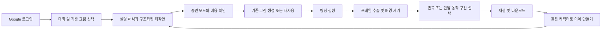
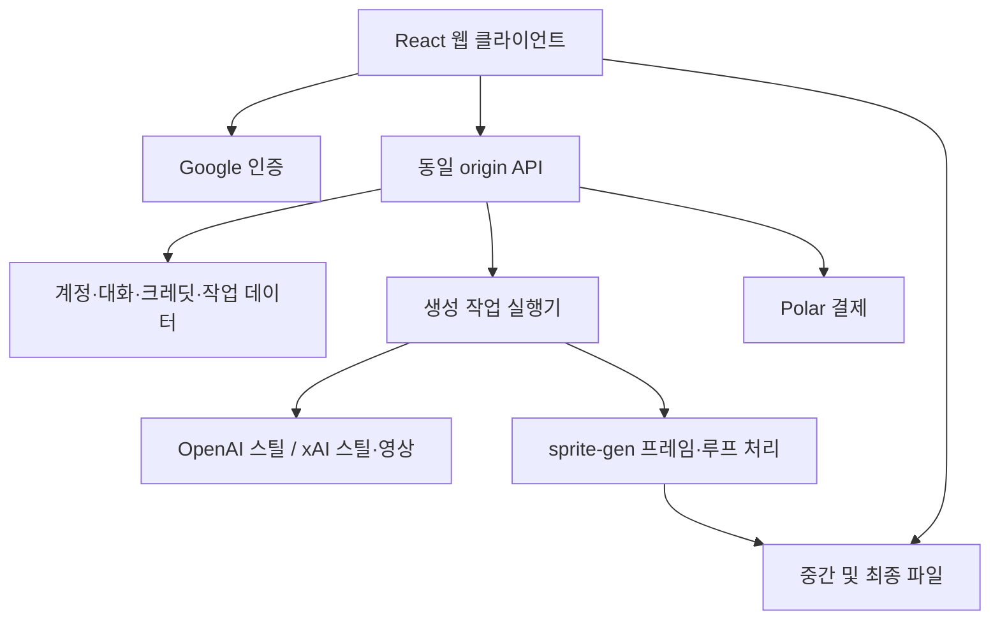

# Spritegen 웹 역기획 — 공개 코드와 인증 관찰

2026-10-04 KST · 대상: [spritegen.kumastudio.app](https://spritegen.kumastudio.app/) · 현재 저장소 기준: `33f06b0` 및 작업 디렉터리

**후속 범위 정정:** 사용자의 목표는 로그인·과금 구현이 아니라 실제 AI 스프라이트 제작·편집 기능이다. 구현 가능성, 기존 Grok 영상 코드, 최신 엔진 차이와 연결 계획은 [AI 스프라이트 에디터 구현 설계](AI_SPRITE_EDITOR_IMPLEMENTATION_2026-10-04.md)를 우선한다. 아래 인증·사업 기능은 조사 기록이며 현재 구현 요구가 아니다.

## 1. 결론과 조사 범위

이 서비스의 중심은 **대화로 제작 의도를 정리하고, 기준 그림을 영상으로 움직인 뒤, 프레임을 추출해 게임용 스프라이트로 내보내는 제작 흐름**이다. Google 로그인은 사용자·대화·그림·결과·크레딧을 연결한다. 로그인과 이미지/영상 생성 공급자 인증은 별개다.

현재 프레임룸은 생성·가져온 PNG를 골라 배율·앵커·순서·시간·픽셀을 편집하는 도구다. 따라서 우선 참고할 부분은 **기준 그림 재사용 → 연속 동작 확보 → 기존 에디터에서 검수·수정**으로 연결하는 흐름이다. 공개 서비스용 회원·결제 시스템은 별도의 제품 범위다.

사용자가 보낸 주소의 `character=아+미안+달리기로`는 입력창에 넣는 초기 문장이다. 특정 생성 결과 ID가 아니다. 대화 주소는 `/app?room=...`, 공개 결과 주소는 `/s/:slug`로 구분된다. 로그인한 사용자의 최근 대화가 복원되는 동작도 있으므로 이 URL만으로 원래 사용자의 결과를 확인할 수는 없다. [S02: `7302` 부근, `8492` 부근]

### 근거 표시

| 표시 | 의미 |
| --- | --- |
| 관찰 | 이번 조사에서 실제 HTTP 응답을 확인 |
| 코드 | 서비스가 공개 배포한 JavaScript의 구현을 확인. 로그인 후 성공 실행은 별도 |
| 서비스 안내 | 서비스 자체 설명·정책. 서버 구현이나 정책 준수 실측을 뜻하지 않음 |
| 공개 엔진 | 공개 `sprite-gen v2.19.0` 코드·문서. 웹 서버의 모든 실행 옵션과 같다고 단정하지 않음 |
| 제안 | 현재 프로젝트에 적용할 후속 설계. 아직 구현하지 않음 |

확인한 범위는 HTML, 주요 웹 번들, 정책 번들, 인증 시작 응답, 비로그인 계정 조회, 공개 엔진의 관련 소스다. 웹 서비스의 원본 서버 저장소·DB·시스템 프롬프트는 확보하지 않았다. 로그인 후 UI, 실제 생성·업로드·결제·공유는 실행하지 않았다. 브라우저 렌더링을 본 것처럼 화면 품질을 평가하지 않는다.

원본과 정리본은 `.data/research/spritegen-2026-10-04/`에 보존했다. 원본 URL·해시·정리본 위치는 [출처 목록](../../research/spritegen/2026-10-04/sources/index.json)에 기록한다. 인증 쿠키 값, OAuth state·nonce·client ID 값은 기록하지 않았다.

## 2. 제품 구조와 사용자 여정



기본 여정은 다음과 같이 복원된다. 승인 모드에 따라 그림 생성이나 애니메이션 시작이 자동으로 이어질 수 있다. [S02: `Pr`, `Kr`; S03: `app`, `assistant`]

1. Google 계정으로 들어가 최근 대화·갤러리·잔액을 복원한다.
2. 캐릭터와 동작을 말하거나 PNG/JPEG/WebP를 첨부한다. 이전 업로드·생성 그림은 ‘내 베이스’에서 고른다.
3. 서버가 대화를 해석해 답변, 그림 제작 제안, 생성 확인 카드, 시작된 작업 중 하나를 반환한다.
4. 그림을 새로 그릴지, 그대로 재사용할지, 방향·외형 때문에 다시 그릴지 안내한다.
5. 확인 카드에서 캐릭터·동작·스타일, 영상 모델·해상도·길이, 필요한 경우 스틸 공급자·품질을 검토한다.
6. 작업 카드가 준비 → 스틸 → 영상 → 배경 제거 → 구간 선택 단계를 표시한다.
7. 결과를 재생하고 GIF·스트립 PNG·격자 PNG·WebP 중 제공된 파일을 받는다. 같은 캐릭터로 다른 동작을 요청하거나 좌우 반전·공유를 실행할 수 있다.

### 화면 및 기능 목록

| 영역 | 코드에서 확인한 기능 | 근거·제약 |
| --- | --- | --- |
| 랜딩 `/` | 실제 예제 재생, 제작 단계 설명, 가격·FAQ, 로그인 유도 | 홍보 예제가 모든 요청의 품질을 보장하지 않음 |
| 제작 `/app` | 대화, 이미지 첨부, 승인 모드, 생성 확인 카드, 작업 결과 | 계정 조회 성공 여부로 진입 화면 분기 |
| 입력창 | 여러 줄 입력, Enter 전송, Shift+Enter 줄바꿈, IME 조합 보호, 드롭·붙여넣기 | 빠른 동작 버튼은 걷기·대기·공격 |
| 동작 사전 | 대기·걷기·달리기·제자리 뛰기·공격·환호·손 흔들기 | 라벨과 분기 존재. 모든 조합의 생성 성공은 미검증 |
| 방향 | 옆·앞·뒤·앞 대각선·뒤 대각선 | 좌우 반전 결과는 별도 표시. 비대칭 장비 보존 여부는 별도 검수 필요 |
| 내 베이스 | 업로드한 그림과 생성한 기준 그림 재사용 | 업로드와 생성 결과의 `source`를 구분 |
| 생성 카드 | 조건별 견적, 잔액 부족 안내, 허용 조합 확인 | 옵션·가격을 서버의 `quotes`에서 구성 |
| 묶음 제작 | 방향별 스틸, 동작 생성, 반전 작업의 진행 표시 | `waiting/drawing/making/done/failed/skipped` 표시 |
| 작업 카드 | 중간 스틸·영상·완성 애니메이션, 경과 시간, 실패 이유 | 실패 전 중간 영상도 표시·다운로드 가능 |
| 갤러리 | 대화 목록, 대표 결과, 새 대화, 이전 대화 복원 | 결과물만 모은 목록보다 대화 단위에 가까움 |
| 크레딧 | 잔액, 쿠폰, 충전, 첫 충전 혜택 | 결제는 Polar로 이동. 실제 결제 미실행 |
| 공유 `/s/:slug` | 완성 결과 재생·정보·같은 설명으로 제작 진입 | 사용자가 공유를 실행해 slug를 받는 흐름 |
| 운영 `/admin` | 라우트와 지연 로드 선언 존재 | 관리자 코드·기능·접근 권한은 조사 대상에서 제외 |

에디터의 프레임별 펜, 수동 앵커, 타임라인 재정렬, 가변 프레임 시간, Aseprite/runtime 출력에 해당하는 사용자 기능은 **분석한 웹 제작 화면에서 확인하지 못했다**. 서비스 전체에 절대 존재하지 않는다는 뜻은 아니다.

## 3. 대화는 제작 명령을 구조화하는 입구다

`POST /api/chat`은 일반 텍스트만 돌려주는 채팅이 아니다. UI가 응답 종류에 따라 다른 작업을 연다. [S03: `F`; S02: `8178` 부근]

| 응답 분기 | 화면 및 후속 동작 |
| --- | --- |
| `kind: chat` | 설명·추가 질문·이전 결과 없음 안내 |
| `kind: card` | `draft`, `defaults`, `quotes`를 가진 생성 확인 카드 |
| `kind: still_offer` | 크레딧을 표시한 그림 생성 제안 |
| `kind: still` 및 `still_job` | 그림 작업 표시, 필요하면 후속 batch와 연결 |
| `kind: started` | 자동 시작한 단일 작업 또는 batch 표시 |

관찰된 클라이언트 요청의 최소 형태는 다음과 같다. 아래 타입은 **클라이언트가 쓰는 필드의 요약**이며, 서버의 완전한 검증 스키마가 아니다.

```ts
type ChatRequest = {
  message: string;
  conversation_id: string;
  locale: string;
  base_id?: string;
  context_base_id?: string;
};

type GenerationSettings = {
  model: string;       // UI에 Lite / Pro 라벨
  resolution: string;
  duration: number;
  provider: string;    // UI에 OpenAI / Grok 라벨
  quality: string;
};

type CreateJobRequest = {
  prompt: string;
  draft: unknown;      // 최소 character/state/direction/style을 UI가 사용
  settings: GenerationSettings;
  base_id?: string;
  conversation_id?: string;
  turn_seq?: number;
};
```

- 견적은 `model/resolution/duration/provider/quality` 다섯 값이 모두 맞는 항목에서 찾는다. 없는 조합은 생성 버튼을 막는다.
- 길이·해상도·품질의 전체 허용 목록과 실제 비용표는 로그인 후 서버 응답이 필요하다. 프런트의 라벨만으로 지원 옵션을 확정하면 안 된다.
- `480p`는 코드상 초안 표시 대상이다. 서비스는 가장자리에 흰 테두리가 남을 수 있다고 안내한다.
- 기준 이미지 재사용이면 스틸 생성 옵션을 숨긴다. 방향·외형 변경으로 다시 그리면 비용이 추가된다는 안내가 있다.
- 새 요청이 들어오면 이전에 열린 확인 카드를 `replaced`로 바꾼다. 오래된 요청을 잘못 실행하지 않도록 대화·작업의 순서도 추적한다.
- `turn_seq`와 `conversation_id`로 대화의 어느 요청에서 그림·동작을 만들었는지 연결한다.

승인 모드는 `ask`(그림·동작 모두 버튼 승인), `pictures`(그림 자동, 동작 승인), `all`(둘 다 자동)이다. `all`로 바꾸는 UI에는 자동 제작과 크레딧 차감을 알리는 추가 확인이 있다. 사이트에 로그인한 것만으로 모든 생성 실행을 승인한 것으로 취급하지 않는다.

## 4. Google 로그인의 실제 역할

### 이번에 관찰한 응답

| 요청 | 실제 응답 |
| --- | --- |
| `GET /api/me`, 쿠키 없음 | `401`, `{"ok":false,"error":"unauthenticated","reason":"absent"}` |
| `GET /api/auth/google`, 리다이렉트 미추적 | `302` → `https://accounts.google.com/o/oauth2/v2/auth` |
| OAuth 요청 권한 | `openid email profile` |
| OAuth 방식 | `response_type=code`, `access_type=online`, `prompt=select_account` |
| callback 주소 | `https://spritegen.kumastudio.app/api/auth/callback` |
| 요청의 검증 값 | `state`, `nonce` 필드 존재. 값은 저장하지 않음 |
| 임시 쿠키 | `__Host-sg_oauth`; `Path=/; HttpOnly; SameSite=Lax; Secure; Max-Age=600` |

인증 시작까지만 확인했고 계정 선택·동의·callback 성공·로그인 유지·로그아웃은 실행하지 않았다. [S05, S06]

### 코드·서비스 안내와 결합한 흐름

`Google 로그인 시작 → Google 인증 → 서버 callback → 서비스 세션 발급 → /api/me → 계정별 제작 화면`

클라이언트는 요청에 `credentials: same-origin`을 사용한다. `/api/me`에서 사용자 ID·이메일·이름·사진·가입 시각, 크레딧, 채팅 사용량, 반전 비용, 승인 모드, 프로모션을 읽는다. HTML 단계에서 계정 조회를 미리 시작해 앱 실행 뒤 결과를 재사용한다. [S01, S03]

서비스 개인정보 안내는 로그인 세션을 `__Host-sg_session`이라는 서명 쿠키로 30일 유지하며 계정 번호·만료 시각을 담는다고 설명한다. 이는 **정책의 설명**이고 로그인 성공 응답으로 검증한 내용은 아니다. 계정과 업로드·결과·대화·크레딧 내역을 연결하기 때문에 Google 로그인이 필요한 제품 구성이다. [S04]

Google의 메일·Drive 접근 권한은 이번 요청에 없다. 모델 호출은 서버가 OpenAI·xAI에 맡긴다고 안내한다. **Google 계정 로그인, ChatGPT 구독 로그인, 모델 API 비용은 각각 다른 문제**다. 현재 프레임룸의 Codex 구독 경로를 이 사이트의 Google 로그인으로 대체할 수 없다.

## 5. 시스템 구성



| 구성 | 근거 수준 |
| --- | --- |
| React 기반 클라이언트, 동일 origin `/api` | 배포 번들 확인 |
| Cloudflare에서 사이트·DB·파일 보관 | 서비스 개인정보 안내. HTML에 Worker의 공유 메타데이터 처리 주석도 있음 |
| Modal에서 생성 실행 | 서비스 개인정보 안내 |
| 스틸: OpenAI gpt-image, xAI Grok Imagine | 사이트 표시값. 실제 호출별 모델 ID는 미확인 |
| 영상: xAI Grok Imagine Video | 사이트 표시값 |
| 대화: OpenAI gpt-6-luna | 사이트 표시값. 실제 서버 요청은 미확인 |
| 엔진: sprite-gen v2.19.0 | 사이트 표시값 및 해당 공개 태그 확인. 배포 서버 바이너리 검사 아님 |
| Cloudflare D1/R2 사용, 정확한 큐·DB 스키마 | 이번 자료로 확인하지 못함 |

진행 중인 작업·batch는 **4초 간격 폴링**으로 갱신한다. 숨겨진 탭에서는 주기 조회를 멈추고 다시 보이면 조회한다. 이 작업 추적 경로는 공개 코드상 SSE나 WebSocket을 요구하지 않는다. [S02: `Lr`, `Kr`]

복원용 응답은 `conversation.entries`, `jobs`, `batches`를 함께 사용한다. 화면을 새로 열면 저장된 대화 항목과 작업 상태를 다시 조합한다. 이는 단순히 브라우저에 채팅 문장만 저장하는 방식보다 서버 측 상태가 중요한 구조다.

## 6. 영상에서 스프라이트를 만드는 방법과 한계

사이트와 연결된 공개 엔진 `v2.19.0`의 commit은 `9e8cf1e238495b2b113e4acf1f73517e1fbe6e70`이다. 아래는 그 버전의 소스·문서 분석이다. 웹 서버가 모든 옵션을 그대로 사용하는지는 확인하지 못했다. [S07–S13]

| 단계 | 공개 엔진에서 하는 일 | 기획에 주는 의미 |
| --- | --- | --- |
| 동작용 캔버스 | 점프·공격 등에 맞춰 여백과 비율을 조정 | 머리·무기가 화면 밖으로 나가는 문제는 프롬프트만으로 해결하기 어려움 |
| 영상 생성 | 기준 그림과 동작·방향·제자리 유지 조건 사용 | 연속된 중간 자세를 확보할 수 있음. 외형 유지·정확한 동작은 여전히 검수 필요 |
| 추출·배경 제거 | 프레임별 키 색 제거, 번짐 보정, 화면 가장자리 접촉 검사 | 배경 잔색과 실제 몸 잘림을 나눠 실패 이유를 알려야 함 |
| 반복 구간 | 축소 프레임 거리와 시차별 반복 정도로 주기를 먼저 찾고 시작 위치를 선택 | 첫·끝이 비슷한 두 장만 찾는 방법보다 연속성을 다룸 |
| 단발 동작 | 준비 → 행동 → 복귀 구간을 별도 탐색 | 점프·공격을 무조건 보행 반복 검출에 넣지 않음 |
| 정렬·패킹 | 전체 동작 범위의 공통 crop, 기준 몸 높이·배율, 선택적 앵커 보정 | 포즈별 높이를 제각각 늘리는 것과 다름 |
| 출력 | 스트립·GIF·WebP와 프레임 수·시간·셀 정보 검사 | 생성 완료와 엔진에서 쓸 파일 완성을 구분 |

### ‘자연스러운 걷기’가 보장되는가

보장되지 않는다. 반복 검출은 시간적 유사도와 연결을 측정하며, 해부학적인 왼발·오른발의 정체를 판단하지 않는다. 잘못된 자세가 규칙적으로 반복돼도 점수가 좋을 수 있다. 공개 엔진 문서도 올바른 발 교대가 중요하면 눈으로 확인하도록 명시한다.

`walk/run`의 반주기 오검출을 줄이는 조건과 반복 주변 구간 비교가 있지만, 이것을 보행 의미 판정으로 소개하면 안 된다. 최신 버전의 RIFE 보정도 이웃 프레임 사이에서 튀는 일부 프레임을 보간하는 기능이다. 누락된 반대발 동작을 정확히 새로 설계한다는 보장은 없다.

### 현재 고정 엔진과 비교할 항목

| 공개 버전 | 확인된 변화 | 현재 프로젝트에서의 검토 대상 |
| --- | --- | --- |
| v2.13–v2.16 | 방향별 보행 문구, 제자리 유지, 느리거나 크기가 흐르는 영상의 재탐색 | 영상 경로를 도입할 경우 기존 후보 생성과 비교 |
| v2.17 | 앞/뒤 대각선 방향 | 다방향이 실제 제품 범위에 들어올 때 검토 |
| v2.18 | 선택적 RIFE 보정, 방향별 주기 맞춤, 중간 걸음 자세의 기준 그림 | 보정 전후 재생 비교와 보간 프레임 출처 보존 필요 |
| v2.19 | 축소·확대 시 색과 알파 처리 개선, 앞/뒤 기준 그림의 방향 지시 개선 | 경계의 흰 띠·키 색 오염에 대한 비교 후보 |

현재 프로젝트는 v2.12.1에 고정되어 있고 로컬 패치도 존재한다. 이번 분석에서 엔진 교체·패치 적용·RIFE 설치를 하지 않았다. 버전 번호만 보고 기존 편집·출력 계약까지 일괄 교체할 이유는 없다.

## 7. 클라이언트에서 복원한 API 목록

다음은 공개 코드가 호출하는 계약의 윤곽이다. 실제 서버 스키마·소유권 검증·재시도/중복 방지·차감 트랜잭션의 완전한 명세가 아니다. 인증 시작과 비로그인 `/api/me` 외에는 서버 호출로 검증하지 않았다. [S03: `F`]

| 묶음 | 메서드·경로 | 역할 및 관찰 필드 |
| --- | --- | --- |
| 인증 | `GET /api/auth/google` | Google 인증 시작; 실제 302 확인 |
| 인증 | `GET /api/auth/callback` | OAuth redirect URI에서 확인한 수신 경로; 성공 미실행 |
| 계정 | `GET /api/me` | 사용자·잔액·채팅 사용량·반전 비용·승인 모드 |
| 계정 | `POST /api/auth/logout` | 서비스 로그아웃 |
| 계정 | `PUT /api/me/approval-mode` | `{ mode }` |
| 대화 | `GET /api/conversations`, `GET /api/conversations/latest`, `GET /api/conversations/:id` | 목록·최근·지정 대화 복원 |
| 대화 | `POST /api/conversations` | 새 대화 ID 생성 |
| 대화 | `POST /api/chat` | 문장·locale·대화·첨부/문맥 기준 그림 전달 |
| 그림 | `GET /api/bases`, `POST /api/bases` | 기준 그림 목록·업로드. 업로드는 Blob 및 해당 content-type 사용 |
| 그림 | `POST /api/stills` | 그림만 생성하는 작업 |
| 그림 | `POST /api/jobs/:id/card`, `POST /api/jobs/:id/redraw` | 기존 그림으로 확인 카드 열기·다시 그리기 |
| 생성 | `POST /api/jobs` | prompt·draft·settings·base·대화 순서로 단일 작업 생성 |
| 생성 | `GET /api/jobs`, `GET /api/jobs/:id` | 생성 목록·상태·파일 |
| 생성 | `POST /api/jobs/:id/revise` | 설명을 수정한 확인 카드 요청 |
| 반전 | `POST /api/jobs/:id/mirror` | 반전 작업. 응답의 `duplicate`로 기존 작업을 재사용하는 UI 분기 |
| 묶음 | `POST /api/batches`, `GET /api/batches/:id` | 같은 기준을 쓰는 묶음 제작·상태 |
| 공유 | `POST /api/gallery/:id/share`, `GET /api/s/:slug` | 공유 slug 발급·공개 결과 읽기 |
| 크레딧 | `POST /api/coupons/redeem` | `{ code }` → 지급량·잔액 |
| 결제 | `POST /api/billing/checkout` | `{ pack }` → 결제 이동 URL |

분석에 필요한 개념 모델은 `User → Conversation → Entry → Job/Batch → Artifact`, 별도로 `Base`, `Draft/Quote`, `CreditLedger`, `Share`다. `CreditLedger` 등은 기획용 모델이며 실제 테이블 이름을 알아낸 것이 아니다.

## 8. 운영·비용·실패 처리

- 가입 선물은 공개 표시상 200크레딧이다. 표시된 Starter는 1,000크레딧/$9.68, Studio는 3,000크레딧/$26.18이며 할인 전 가격도 함께 보인다. **조사 시점 번들 표시값**이고 결제 화면의 최종 금액을 확인한 것은 아니다.
- 생성 비용은 설정별 서버 견적이다. 1회 고정 비용으로 구현하면 기준 그림 재사용·길이·모델 차이를 반영하지 못한다.
- 채팅도 `free_per_day`, `used_today`, `next_cost_credits`를 가진다. 모든 대화가 무제한 무료라고 볼 수 없다.
- 실패 시 환급·자동 재시도 시 추가 차감 없음은 서비스 안내다. 결과가 완성됐지만 마음에 들지 않는 경우와 기술적 실패를 구분한다. 실제 차감·환급·중복 결제 처리는 미검증이다.
- 재생성, 반전, 그림 다시 그리기의 비용과 실행 상태가 분리되어 있다.
- 재시도 전 버린 그림·영상을 `discarded`로 보관해 다시 찍은 이유를 보여준다. 배경 불균일, 키 색 제거 실패, 몸 잘림, 반복 미검출, 끝/처음 불일치 등을 구분한다.
- 대화 복원·생성 상태 조회 실패와 실제 생성 실패는 별도 UI 상태다. 네트워크 조회 실패만으로 결과를 실패 처리하지 않는 설계다.

## 9. 프레임룸과의 차이 및 적용안

| 항목 | 조사한 Spritegen 웹 | 현재 프레임룸의 실제 코드 |
| --- | --- | --- |
| 핵심 작업 | 대화로 기준 그림·영상·스프라이트를 연속 제작 | 후보 PNG 정렬·선택·프레임 및 픽셀 편집 |
| 동작 확보 | 영상에서 연속 프레임 추출 | Codex 이미지 생성 또는 기존 원본 가져오기 |
| 계정 | Google 로그인·서버 계정 | loopback 전용 서비스, 로컬 mutation token |
| 생성 경로 | OpenAI/xAI를 서비스가 실행한다고 안내 | Codex·ChatGPT 구독 경로 활성, OpenAI API/Grok 비활성 |
| 비용 | 계정별 크레딧·견적·결제 | 서비스 크레딧 판매 없음 |
| 기준 그림 | 이전 스틸 재사용·방향/외형 재생성 | 외형·스타일·자세 참조, 승인한 기준 revision |
| 후편집 | 분석한 UI에서는 세밀한 프레임 편집 미확인 | 공통 배율·수동 앵커·순서·가변 시간·픽셀 수정 |
| 출력 신뢰성 | 엔진 QA·실패 사유·작업 파일 | revision·원본 계보·확정 bake·runtime·QA |
| 저장 복원 | 계정별 대화·갤러리·클라우드 파일 | SQLite·로컬 파일·명시적 저장·백업 ZIP |

근거: 현재 [provider](../../adapters/spritegen/provider.py), [API](../../services/api/main.py), [프런트 타입](../../apps/web/src/types.ts), [README](../../README.md).

### 제안 A — 현재 제작 도구 개선

우선순위는 다음 순서가 적절하다. 이는 구현 제안이며 기존 범위 합의를 자동 변경하지 않는다.

1. **기준 그림 선택과 이어 만들기 단순화.** 이미 있는 reference revision과 원본 계보를 활용해 어느 그림에서 시작하는지 명확히 한다.
2. **영상 경로의 효과를 제한된 비교 실험으로 확인.** 같은 기준 그림·같은 동작을 써서 기존 후보 조합과 비교한다. Grok 등 제공자·비용·실행 승인은 그때 별도로 확정한다.
3. **영상에서 나온 후보를 현재 편집기로 연결.** 추출 원본, 선택 구간, 공통 배율, 보정·보간 여부를 보존하고 기존 앵커·타임라인 검수로 넘긴다.
4. **작업 단계·실패 이유·중간 결과 설명 개선.** 자동 재생성 전에 어떤 실패인지 검토할 수 있게 한다.
5. **대화형 제작안은 기존 편집 명령 위에 얹기.** AI가 대상 frame ID·허용 명령·시간을 제안하고 서버가 검증하게 한다. 이미지의 자연스러움을 JSON 형식만으로 보장하지 않는다.

비교 실험의 통과 조건은 주요 장비·의상 요소와 스타일 유지, 보정 후의 크기·위치, 실제 동작 연결, 잘림·잔색, 편집 가능한 원본·시간 정보다. 픽셀의 미세 차이나 보정 전의 단순 높이 차이만으로 외형 불합격을 정하지 않는다.

### 제안 B — 공개 웹서비스를 만들기로 할 경우

공개 서비스가 목표라면 Google 로그인 버튼 외에 사용자별 데이터 소유권과 실행 비용 통제가 필요하다.

| 기능 | 구현 전 정할 계약 | 수용 기준 |
| --- | --- | --- |
| 로그인 | 최소 Google scope, callback, 세션 만료·로그아웃 | 정상/취소/만료/재접속 흐름을 실제 계정으로 확인 |
| 소유권 | project/base/job/artifact/conversation의 owner | 다른 사용자의 ID를 넣어도 조회·수정·파일 접근 불가 |
| 생성 승인 | 승인 모드, 견적 고정·만료, 이중 클릭 처리 | 예상 비용과 실제 차감 일치, 자동 실행 범위 명확 |
| 작업 복구 | 작업 ID, 상태, 중간 산출물, 재시도·중복 방지 | 새로고침·끊김 이후 동일 작업 복원, 중복 비용 없음 |
| 결제 | 결제 확인·지급·환급 원장 | 중복 통지에도 한 번만 지급·환급 |
| 공유 | 공개할 파일·설명과 원본의 경계 | 공유하지 않은 업로드 원본은 공개 결과에서 접근 불가 |
| 검수 | 기술 QA와 사람의 외형·동작 판단 분리 | 자동 검사 통과를 자연스러운 보행으로 오인하지 않음 |

현재 `/v1/health`가 제공하는 로컬 session token과 loopback 전제는 다중 사용자 로그인 설계가 아니다. 공개 배포로 바꿀 때 사용자·파일 소유권부터 설계해야 한다. 특정 인증/DB 제공자 선택이나 배포 작업은 이번 범위에서 진행하지 않았다.

## 10. 검증 결과와 남은 확인

| 검증 | 결과 |
| --- | --- |
| 사용자 URL 및 `/app` HTML 읽기 | 성공, HTTP 200 |
| 주요 웹·정책 번들 수집·구문 분석 | 성공, 원본 SHA-256 보존 |
| Google 인증 시작·요청 scope·임시 쿠키 속성 | 관찰 완료, 302. 계정 인증은 미실행 |
| 비로그인 `/api/me` | 예상대로 401 |
| 공개 엔진 태그·관련 소스 대조 | v2.19.0의 commit과 루프·프레임·정렬 코드 확인 |
| 기존 프레임룸 코드 비교 | API·provider·데이터 타입 확인. 기존 앱 테스트를 재실행한 것은 아님 |
| 실제 로그인 후 UI·접근성·반응형 화면 | 미검증 |
| 생성 성공·대기 시간·모델별 품질·비용 | 미검증 |
| 결제·환급·공유·다중 사용자 격리 | 미검증 |

로그인 후 추가로 확인할 핵심은 실제 `quotes`와 옵션 범위, 업로드 이미지의 재사용/재생성 기준, 자동 승인 모드의 초기값, 갤러리 복원, 묶음 제작의 부분 실패, 다운로드의 크기·알파·메타데이터다. 비용이 드는 요청은 아래 최소 비용 원칙을 따른다.

### 사용자 크레딧 제약과 후속 데이터 수집

사용자가 이번 조사에 사용할 수 있다고 알린 잔액은 **500크레딧**이다. 이는 사용자 제공 정보이며 `/api/me`로 확인한 잔액은 아니다. 현재까지 이번 조사에서 사용한 크레딧은 **0**이다. 500개를 소진할 목표로 삼지 않고, 역기획에 필요한 최소 데이터에만 사용한다.

| 순서 | 확보할 데이터 | 최소 비용 원칙 |
| --- | --- | --- |
| 1 | 로그인 후 계정의 승인 모드·채팅 다음 비용·반전 비용·실제 잔액 | 기존 계정 조회. 쿠키·토큰·개인 식별값은 보고서에 기록하지 않음 |
| 2 | 기존 대화에 남은 `draft/defaults/quotes`, 기존 job·batch의 상태·파일 구조 | 기존 기록 조회를 우선. 새 대화 전송이나 생성 없이 확보 가능한지 확인 |
| 3 | 기존 완성 파일의 프레임 수·셀 크기·알파·재생 시간 | 기존 파일 중 필요한 최소 표본만 확인 |
| 4 | 기존 자료에 없는 필수 요청/응답 | 다음 채팅 비용을 먼저 확인. 과금 시 한 번의 좁은 질문으로 확보 |
| 5 | 그래도 확인할 수 없는 핵심 생성 계약 | 표시 견적과 잔액 안에서 필요한 최소 단일 작업만 고려. 정보 확보에 불필요한 생성은 실행하지 않음 |

여러 모델·방향의 품질 비교, 반복 재생성, batch, 좌우 반전은 비용 대비 새로 얻는 필수 정보가 명확하지 않으면 실행하지 않는다. `pictures/all` 모드에서는 메시지 하나가 생성으로 이어질 수 있으므로 전송 전에 모드를 확인한다. 실행할 경우 작업별 목적·예상 비용·전후 잔액·성공/환급을 기록하고, 필수 정보가 확보되면 잔여 크레딧과 관계없이 중단한다. 이번 요청으로 크레딧 충전이나 결제를 승인받은 것은 아니다.

이번 작업에서 추가한 것은 조사 문서와 출처 목록이다. 기존 앱 코드·사용자 데이터·로컬 엔진 변경을 보존했다. 생성 요청·크레딧 차감·결제·공유·Git 게시·배포는 실행하지 않았다.

## 출처 색인

- S01: [서비스 HTML](https://spritegen.kumastudio.app/app), 로컬 `app.html`.
- S02: [화면·상태 관리 번들](https://spritegen.kumastudio.app/assets/index-HevQwqbb.js), 로컬 `index-HevQwqbb.expanded.js`. 줄 번호는 TypeScript printer로 읽기 좋게 정리한 이 파일 기준이다.
- S03: [API 클라이언트·제품 문구·설정 번들](https://spritegen.kumastudio.app/assets/prose-YT059QrL.js), 로컬 `prose-YT059QrL.expanded.js`.
- S04: [서비스 개인정보 안내](https://spritegen.kumastudio.app/privacy), [정책 번들](https://spritegen.kumastudio.app/assets/LegalPage-BZzN59_E.js), 로컬 `LegalPage-BZzN59_E.expanded.js`의 한국어 개인정보 부분 `802` 부근.
- S05: [계정 조회](https://spritegen.kumastudio.app/api/me), 로컬 `me`에 비로그인 응답 보존.
- S06: [인증 시작](https://spritegen.kumastudio.app/api/auth/google), 로컬 `auth-observation.json`에 비밀값을 제외한 응답 요약 보존.
- S07: [공개 엔진 v2.19.0](https://github.com/aldegad/sprite-gen/releases/tag/v2.19.0), tree commit `9e8cf1e238495b2b113e4acf1f73517e1fbe6e70`.
- S08: [영상 파이프라인](https://github.com/aldegad/sprite-gen/blob/v2.19.0/docs/video-pipeline.md).
- S09: [루프 구현](https://github.com/aldegad/sprite-gen/blob/v2.19.0/sprite_gen/video/loop.py).
- S10: [프레임 처리](https://github.com/aldegad/sprite-gen/blob/v2.19.0/sprite_gen/video/frames.py).
- S11: [루프 검수 계약](https://github.com/aldegad/sprite-gen/blob/v2.19.0/docs/loop-review.md).
- S12: [루프 보정 설명](https://github.com/aldegad/sprite-gen/blob/v2.19.0/docs/loop-repair.md).
- S13: [버전 변경 기록](https://github.com/aldegad/sprite-gen/blob/v2.19.0/CHANGELOG.md).
