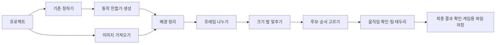

# 캐릭터 스프라이트 제작 앱 UX 설계

> 2026-10-06 자료 정리: 아래 조사·실험의 원본, 비교 결과와 전용 스크립트는 사용자 요청으로 삭제했다. 제품 결정·구현 기록은 보존하며 과거 경로를 현재 실행 가능한 자료로 해석하지 않는다.

작성일: 2026-10-03 KST · 구현 기준 문서 · 앱 구현·수용 시험·실제 provider 호출 완료를 뜻하지 않는다.

## 1. 적용 범위와 고정 결정

이 문서는 [사용자 합의](../planning/USER_DECISIONS.md)와 연구의 README (리서치 정리로 삭제), 화면 흐름 (리서치 정리로 삭제), 데이터 계약 (리서치 정리로 삭제), 수용 계획 (리서치 정리로 삭제), 실험 결과 (리서치 정리로 삭제)를 제품 화면 계약으로 확정한다. 연구의 제안 화면이나 19개 관찰 검사를 구현된 제품으로 표시하지 않는다. 위험 재현을 포함한 연구 19개 pass와 [앱 수용 시험 34개](ACCEPTANCE_TESTS.md)의 `NOT_RUN`은 별개다.

- 구성은 **React + Vite + TypeScript / FastAPI / SQLite / 로컬 독립 Python worker**다. 브라우저 탭의 수명과 작업 실행을 분리한다. 사용자 배포본은 정적 UI와 로컬 API를 한 origin에서 제공한다.
- 엔진은 프로젝트 내부의 전용 포크를 사용한다. 기준은 **v2.12.1 / `b058341f7543f3adcbea227bd4e6b7587895b1bc`**이며 `LICENSE`·`NOTICE`를 보존한다. `/Users/cheng80/.codex/skills/sprite-gen` 공용 설치본을 수정하거나 제품 실행 의존 경로로 사용하지 않는다.
- 기존 이미지 경로와 실제 생성 경로 모두 앞단부터 출력까지 UI에서 끝낸다. 사용자가 CLI를 입력하거나 JSON을 고치는 단계는 없다.
- 원본은 immutable이다. 추출 시 **fit 이전 raw crop·좌표·변환 이력**을 보존하고 같은 그룹의 공통 배율을 적용한다. 애니메이션에서 자세별 높이 정규화와 프레임별 자동 축소를 금지한다.
- 가변 `durationMs`는 **최종 MVP 필수**다. 초기 구현에서만 FPS+hold를 허용하며, 그 단계는 최종 MVP 또는 P0 완료가 아니다.
- 최종 승인 미리보기·PNG·atlas·metadata는 **하나의 immutable bake**를 읽는다. 출력에는 서버의 저장 revision ACK가 필요하다. 빈 timeline은 출력하지 않는다.
- 실제 알파를 보존하고 검사한다. 지원 provider의 native alpha는 명시적으로 요청하고 응답에서 검증한다. 불투명 체크무늬를 투명 완료로 취급하지 않는다. provider 실패 시 유료 대체 provider로 자동 전환하지 않는다.
- PXF/effect_editer, 영상 입력·출력, 보간, 자동 다방향 생성, 원격 협업, 공개 배포는 이번 MVP에서 제외한다. 방향 필드는 현 단일 방향 작업의 기준을 기록하기 위해 필요하다.

## 2. 요구 ID와 화면 책임

| 요구 ID | 고정 요구명 | 담당 화면 / 핵심 상태 |
| --- | --- | --- |
| R01 | 프로젝트·로컬 실행 | 시작, 최근 프로젝트, 로컬 서비스 상태 |
| R02 | 참조·승인 기준 | 기준 정하기, 참조 역할, 승인 revision |
| R03 | 생성 설정·실제 provider 연동 | 동작 만들기, 생성 연결, capability와 실제 호출 이력 |
| R04 | 작업 상태·취소·재시도·복구 | 작업 센터, 단계별 처리, 접수 불명·중단 복구 |
| R05 | 가져오기·배경 제거·추출 | 이미지 가져오기, 배경 정리, 프레임 나누기 |
| R06 | 공통 배율·발 정렬 | 크기·발 맞추기, 수동 앵커, 초과 검사 |
| R07 | 후보·동작·비파괴 편집 | 후보 고르기, 재생 순서, 버전 비교·되돌리기 |
| R08 | 재생·검수·가변 시간 | 움직임 확인, 실제 크기, QA, occurrence별 시간 |
| R09 | 팀 아웃라인 | 움직임 확인의 팀 테두리 패널 |
| R10 | 최종 출력·독립 뷰어 | 최종 결과 확인, 게임용 파일 저장, 출력 뷰어 |
| R11 | 저장·이력·백업 | 공통 저장 표시, 이력, 충돌 해결, 백업·복원 |
| R12 | 환경·원본·공용 엔진·입력 보호 | 시작 진단, 업로드 검증, 원본 보존, 연결·비밀값 보호 |

## 3. 탐색 구조와 공통 레이아웃

2026-10-03 에디터 개편: 아래 단계는 별도 긴 페이지가 아니라 상단 도구 순서다. [에디터 배치·검증 기록](EDITOR_LAYOUT_REVIEW.md)을 현행 구현 기준으로 적용한다.

시작 화면에서 `새 프로젝트`, `프로젝트 열기`, `백업에서 복원`을 제공한다. 프로젝트 안의 단계는 다음 순서를 기본으로 하되 자료가 있는 단계로 돌아갈 수 있다. 저장되지 않은 편집은 화면 이동만으로 버리지 않는다.



이미지 가져오기는 provider 없이 시작할 수 있다. 정렬된 PNG도 기준 이미지 지정·원본 크기 유지 확인·동작 검수를 거쳐 출력한다. 생성은 승인된 외형 기준이 있어야 시작한다. 가져온 자료의 승인과 생성 참조 승인을 화면에서 구분한다.

| 영역 | 상시 내용 / 상호작용 |
| --- | --- |
| 상단 | 프로젝트·캐릭터 이름, 선택 동작·방향, 사용 중 기준 버전, 저장 상태, `되돌리기`·`다시 적용`, 작업 센터 |
| 왼쪽 | 동작·후보 라이브러리. 생성·추출 도구 진입과 선택 후보의 순서 추가 |
| 중앙 | 원본/결과/승인 기준 비교와 편집 캔버스. 선택한 자료의 이름·버전·크기 |
| 오른쪽 | 현재 단계 속성, 적용 범위, 수치 입력, 주 동작. 미지원 옵션의 사유 |
| 아래 | 항상 캔버스와 함께 보이는 재생 순서·슬롯별 표시 시간·복제·순서 이동 |

작업 공간 너비 1100px 이상에서는 세 패널을 동시에 보인다. 좁은 창에서는 라이브러리·속성을 열고 닫으며, 480px 이하에서는 한 패널씩 전환한다. 창 전체는 스크롤하지 않고 자료·타임라인·속성과 도구 설정만 내부 스크롤한다. 작은 창에서도 저장·복구 기능은 유지한다.

`compose-atlas`, `curation.json`, 내부 경로·traceback은 기본 화면에 노출하지 않는다. `진단 정보`를 펼쳤을 때만 비밀값을 제거한 작업 ID·버전·오류 코드를 제공한다. 화면의 `저장됨`, `처리 완료`, `검수 완료`, `출력 준비됨`은 서로 다른 상태다.

## 4. 화면별 구현 계약

### 4.1 프로젝트·로컬 환경 — R01, R11, R12

새 프로젝트 폼은 프로젝트 이름, 캐릭터 이름, 기본 셀 너비·높이를 받는다. 이름은 필수, 크기는 양의 정수다. 첫 MVP는 앱 관리 `.data`를 저장소로 쓰고 위치는 안내만 한다. 임의 폴더 picker나 절대 경로 API는 제공하지 않는다. 백업 다운로드·새 프로젝트 복원으로 자료를 이동할 수 있다. 빈 프로젝트에는 `기준 이미지 등록`과 `완성 PNG 가져오기`를 동등한 진입점으로 둔다.

최근 프로젝트 카드는 이름·최근 저장 시각·미완료 작업 수·누락 자료 유무를 보여준다. 로컬 서비스 상태는 `연결 중 / 사용 가능 / 작업 처리기 연결 끊김 / 서버 연결 끊김`으로 구분한다. worker 장애 중에는 프로젝트 읽기와 확정 결과 보기가 가능하고 새 이미지 처리만 비활성화한다. 서버 연결이 끊기면 편집 초안을 유지하고 저장 성공 표시를 하지 않는다.

첫 실행은 전용 엔진·필요 이미지 처리 의존성·저장 위치 쓰기 가능 여부를 확인한다. 실패 항목과 UI의 재확인 동작을 제공한다. 사용자는 제공된 로컬 실행 수단으로 열 수 있어야 하며 개발 서버 설정을 매번 수정하지 않는다. provider 미연결은 기존 PNG 경로를 막지 않는다. 설치 여부·로그인 여부·실제 생성 성공은 각각 표시한다.

### 4.2 가져오기 — R05, R12

PNG/WebP, 규칙 격자 시트, 지원 atlas+metadata를 파일 선택·드롭으로 받는다. 다중 파일은 이름·크기·실제 알파 유무·중복 내용·가져올 동작을 표로 보여준다. 사용자에게 파일명 정렬을 재생 순서로 강제하지 않는다. 같은 이름의 다른 내용은 별도 asset으로 보존한다. 동일 내용은 저장 bytes를 공유할 수 있지만 파일 label과 사용 관계는 남긴다.

시트 입력에서는 행·열, 원본 영역, 프레임 순서를 입력하고 분리선을 원본 위에 표시한다. 자동 성분과 수동 영역 선택으로 전환할 수 있다. 격자 밖으로 걸친 총구·무기는 잘라서 성공 처리하지 않고 영역 검수로 보낸다. atlas metadata의 지원 여부는 읽기 전에 안내하고 알 수 없는 schema/필드는 조용히 버리지 않는다.

알파 요약에는 완전 투명·반투명·불투명 픽셀 수를 표시한다. `체크무늬가 이미지에 포함되어 있습니다. 배경 정리가 필요합니다.`와 `이미 투명한 이미지입니다.`를 구분한다. native alpha 입력은 기본적으로 배경 제거를 건너뛰며 추가 처리 선택 전 원본과 결과를 비교한다.

파일별 실패는 `파일을 읽을 수 없음 / 크기 한도 초과 / 지원하지 않는 형식 / 자료 누락`과 재선택 동작을 표시한다. 업로드 한도는 서버와 같은 값으로 안내한다. 하나의 batch는 전체 기본 검증 후 등록하며 파일 하나가 실패하면 해당 batch를 등록하지 않고 오류 목록·재선택을 제공한다. 이전 batch에서 성공한 asset은 보존한다. 이름·prompt·metadata는 실행 코드로 해석하지 않는다.

### 4.3 기준 정하기 — R02

외형 기준 1개, 스타일 참조, 자세 참고를 역할별 슬롯으로 구분한다. 각각 원본·1:1·확대·나란히 비교가 가능하다. 폼은 얼굴·머리·의상·장비·팔레트·몸/머리 비율·픽셀 표현·방향의 고정 특징, 허용 변경, 스타일에서 가져오면 안 되는 특징을 받는다. 스타일을 교체해도 외형 슬롯을 바꾸지 않는다.

몸 체고는 승인 서기 이미지의 몸 기준 두 점으로 지정한다. 알파 bbox 높이를 몸 체고로 자동 입력하지 않는다. 두 점의 좌표·좌표계·원본 hash를 표시하고 클릭, 숫자 입력, 키보드 이동을 모두 지원한다. 이미 정렬된 PNG를 크기 변경 없이 쓰는 `원본 크기 유지`는 몸 체고 미측정 상태로도 사용할 수 있다. 목표 몸 체고에 맞춰 배율을 바꾸려면 먼저 몸 기준을 승인한다.

`이 기준 승인`은 참조 역할·규칙·방향·측정값을 고정한 `ReferenceRevision`을 만든다. 승인 시각과 적용 범위를 저장한다. 이후 편집은 새 초안이며 기존 생성 결과의 참조를 소급 변경하지 않는다. 새 초안 B가 있어도 A를 사용하는 동작은 `승인 A 사용 중 · 새 초안 있음`을 표시한다. B로 전환하면 기존 후보는 `이전 기준으로 제작됨`으로 바뀌고 재검수가 필요하다. 기존 A에 고정된 동작을 유지할 때는 해당 동작의 기준 선택을 명시한다.

### 4.4 동작 만들기·생성 연결 — R03, R04

동작 폼은 이름, 방향, 목적/포즈 설명, 요청 프레임 수, 후보 수, 반복/단발, 기본 FPS, provider/model, 품질·해상도, 배경 방식을 받는다. 거너 6동작은 선택형 템플릿이고 8키포즈는 별도 참고 라이브러리다. 템플릿 숫자를 모든 캐릭터에 강제하지 않는다. 폼에서 prompt를 만들고 고급 텍스트 수정을 제공한다. 최종 전송 요약에는 참조 역할·승인 버전·요청 수·지원 옵션을 표시한다.

| provider 표시 | 의미 / 허용 행동 |
| --- | --- |
| 미설정·설치 필요 | 설정 안내, 기존 PNG 가져오기 가능 |
| 로그인 필요 | 해당 provider 연결 동작, 생성 비활성화 |
| 연결 확인됨 | 확인 시각과 범위 표시. 생성 성공·quota 보장은 아님 |
| 최근 생성 성공 | 실제 provider job/request ID와 마지막 성공 시각 연결 |
| 사용 제한·실행 실패 | 원인, 다시 확인/허용된 재시도, 같은 provider 설정 수정 |
| 접수 결과 확인 필요 | 기존 요청 조회 또는 수동 확인. 자동 재전송 금지 |
| 모의 연결 | 개발·검증용 배지. 후보·작업 이력·결과에도 배지 유지 |

capability가 없는 다중 참조·크기·native alpha·취소·결과 조회 옵션은 비활성화하고 이유를 인접 텍스트로 표시한다. 예: `이 연결은 참조 이미지 1장만 지원합니다.` 역할을 합치거나 이미지를 몰래 누락하지 않는다. 필수 조건을 충족할 수 없으면 설정 수정 또는 사용자가 다른 연결을 선택하도록 안내한다.

배경 방식은 `투명 배경 요청`을 capability가 있을 때 선택 가능하게 한다. 실제 응답이 불투명이면 `투명 배경 확인 필요`로 배경 정리 단계에 보낸다. 지원하지 않는 provider에는 가능한 배경 생성 방식만 제시한다. 추정 비용과 알 수 없는 비용을 구분하며 연결 실패·quota 부족을 이유로 유료 provider를 자동 선택하지 않는다. 실제 호출 버튼은 사용자가 고른 provider와 범위만 실행한다.

요청 프레임 수와 실제 결과 수를 나란히 보여준다. 숫자가 다르면 검수 필요로 두고 후보를 자동 복제해 요청 충족처럼 표시하지 않는다. `선택 후보 다시 만들기`는 새 generation version을 생성하며 기존 후보의 채택 상태는 새 결과 승인 전까지 유지한다.

### 4.5 작업 센터 — R04

작업 카드에는 동작, 기준 버전, provider/model 또는 로컬 처리, 단계, 경과 시간, 완료 항목 수, 상태, `결과 보기`, `취소 요청`, `실패 단계 다시 처리`를 둔다. 생성 진행률을 받지 못하면 시간과 단계만 표시한다. 로컬 프레임 처리는 실제 `완료/전체`를 표시한다.

| 내부 상태 | 사용자 표시 | 다음 행동 / 결과 정책 |
| --- | --- | --- |
| `queued` | 대기 중 | 시작 전 취소 가능 |
| `running` | 처리 중 · 현재 단계 | 취소 요청 가능, 성공한 다른 작업은 사용 가능 |
| `needs_review` | 결과 검수가 필요함 | 검수 화면으로 이동. 파일 존재만으로 채택하지 않음 |
| `succeeded` | 처리 완료 | 결과 보기. 캐릭터·동작 검수 승인과 구분 |
| `failed` | 처리 실패 | 원인·보존된 결과·재시도 가능 단계 표시 |
| `cancel_requested` | 취소 요청 중 | 중복 클릭 방지. 외부 처리 중단은 아직 확정하지 않음 |
| `canceled` | 로컬 작업 취소됨 | 외부 취소 확인 여부를 별도 표시. 늦은 결과는 미채택 이력으로 보존 |
| `interrupted` | 실행 중단됨 | 저장된 단계 확인 후 이어가기 |
| `provider_outcome_unknown` | 요청 접수 결과 확인 필요 | job 조회/수동 확인. 자동 새 생성 금지 |

동일 제출의 더블클릭은 하나의 idempotency key로 묶는다. 네트워크가 끊기면 저장된 job을 조회한다. 배경 제거만 실패한 경우 성공한 생성 원본을 재사용한다. 재시도는 새 attempt, 새 생성은 새 generation version이다. 조회·취소 미지원의 이유를 표시하고 외부 exactly-once나 환불을 보장한다고 말하지 않는다.

브라우저를 닫아도 서버 작업은 계속될 수 있음을 작업 센터에 안내한다. 다시 열면 GET snapshot과 이벤트 seq로 상태를 복원한다. 서버/worker 종료 후에는 ledger와 checkpoint를 검사하고 입력 hash가 일치하는 완료 단계만 재사용한다. 불명확한 외부 요청을 다시 실행해서 복구한 것처럼 처리하지 않는다.

### 4.6 배경 정리·프레임 나누기 — R05

배경 정리는 원본/처리 결과 비교, alpha-only, 검정·흰색·마젠타·체크 배경을 제공한다. 지원 범위 안에서 배경색·임계값·가장자리 정리와 수동 mask 복구/삭제를 조절한다. 복잡한 체크무늬 제거는 자동 성공을 전제하지 않는다. 잔여물·halo·장비 손실을 확대와 실제 크기에서 확인하기 전에는 `미검수`다. 빈 알파는 차단한다.

추출은 성분 번호·영역·예상 프레임 수·미할당 성분 수를 표시한다. 사용자는 떨어진 총구/장비를 같은 프레임으로 묶고 불필요 성분을 제외하며 붙은 포즈를 수동 영역·mask로 분리할 수 있다. 합치기·분리·제외는 되돌릴 수 있는 편집이다. 자동 검출 결과와 사람이 확정한 영역은 배지와 선 형태로 구분한다.

각 결과는 raw asset, fit 전 crop/mask, `sourceRect`, `sourceToFrameTransform`, extraction version을 보존한다. 추출 과정에서 캔버스에 맞추는 자세별 확대/축소를 하지 않는다. 이미 정규화된 이미지만 있으면 `원본 배율 확인 불가`이며 원래 체형 복원 완료라고 표시하지 않는다. `입상마다 키 맞추기` 호환 옵션은 이번 애니메이션 MVP에서 비활성화하고 `자세별 크기가 달라져 애니메이션에서 사용할 수 없습니다.`를 표시한다.

### 4.7 크기·발 맞추기 — R06

같은 캐릭터·방향·승인 기준·검수된 원래 배율의 프레임을 하나의 정렬 그룹으로 묶는다. 패널에는 셀 크기, 안전 여백, 바닥 여백, 목표 발점, 승인 몸 체고, 목표 몸 체고, 계산된 공통 배율, 최근접 보간, 적용 프레임 수를 표시한다. 거너 `512×512 / 바닥 18 / 가장자리 2`는 프리셋이며 전역 제한이 아니다.

```text
localAnchor = rawAnchor - cropOrigin
sharedScale = targetBodyHeight / approvedBodyHeight
placement = targetAnchor - sharedScale * localAnchor + authoredOffsetPx
pixelPlacement = floor(placement + 0.5)
```

사전 변환이 있으면 저장한 `sourceToFrameTransform`으로 앵커를 같은 좌표계에 옮긴다. 계산할 수 없으면 `배율 확인 필요`로 남긴다. `원본 크기 유지`는 검수된 동일 배율 입력을 `s=1`로 유지한다. 알파 bbox의 무기 길이로 몸 배율을 바꾸지 않는다. 반올림은 음수 좌표에도 위 수식을 적용하고 소수 앵커·잔차를 저장한다.

캔버스에는 원본 alpha bbox, 몸 기준선, 자동 발 후보, 확정 발점, 목표선, 안전 영역, 초과 부분을 별도로 표시한다. `자동 후보 / 수동 확정 / 공중 / 확인 필요`를 구분한다. 자동 후보 기본은 `alpha>=16`, 하단 `max(4, floor(height*0.12+0.5))` 밴드, 양 극점 중간값이다. 이는 거너 휴리스틱이며 해부학적 발 판정이 아니다.

발점은 드래그·숫자 입력·화살표 1px 이동으로 수정하고 `자동 후보 다시 계산`은 수동 확정값을 덮어쓰지 않는다. 자동값으로 돌아가는 별도 동작은 검수 상태를 되돌린다. 발 아래 장비·망토·다중 접지에는 발 ROI와 수동 지정을 제공한다. 공중 프레임은 승인 root anchor/trajectory와 의도된 offset을 사용해 점프 높이를 보존한다.

overflow는 최종 `alpha>0` support와 효과·아웃라인까지 포함해 판정한다. 네 변 초과량과 관련 frame ID를 표시하고 `셀 키우기 / 그룹 전체 축소 / 추출 영역 수정`을 제공한다. 자르기나 해당 포즈만 축소하는 자동 수정은 없다. 그룹 변경은 새 revision이며 관련 검수를 갱신한다. 거너 호환의 `0.85` 값은 비교 설명에만 노출하며 전역 크기 제한 또는 독립 fit 허용 근거로 사용하지 않는다.

### 4.8 후보·순서 고르기 — R07

후보 풀과 실제 재생 순서를 분리한다. 후보 카드에는 동작, frame/version, 참조 기준 버전, 생성/가져오기 출처, QA, 사용 횟수를 표시한다. 조작은 채택, 숨기기, 대체, 복제, 앞/뒤 추가, 순서 이동, occurrence별 offset·지원 변형·픽셀 편집, 되돌리기·다시 적용이다. 후보 숨김이나 순서에서 제거는 원본 삭제가 아니다.

`[A,B,A,C]`에서 두 A는 같은 frame version을 참조하는 서로 다른 occurrence다. 두 슬롯의 시간·offset·픽셀 편집을 독립 저장한다. engine index로 정체성을 판단하지 않으며 adapter가 clone 또는 동등한 고유 슬롯으로 매핑한다. 마지막 occurrence를 제거하면 `재생할 프레임이 없습니다. 후보를 추가하세요.`와 비활성 출력 버튼을 보인다. 빈 선택을 전체 후보로 대체하지 않는다.

기존 큐레이션 기능은 단일 저장·선택·revision 체계에 통합한다. 별도 iframe의 이중 저장으로 완료 처리하지 않는다. 가져온 기존 curation의 지원하지 않는 필드는 원본을 보존하고 이유와 검수/차단을 표시한다. UI에 없는 숨은 효과가 bake에만 적용되면 안 된다. breathing/rig 등 동등성이 검증되지 않은 옵션은 비활성화한다.

부분 재생성은 이전 B와 새 B를 나란히 비교한 뒤 채택한다. 논리 frame ID는 유지하고 frame version/generation version은 새로 부여한다. A/C의 픽셀·승인·앵커·offset은 바꾸지 않는다. 새 B의 hash가 달라지면 이전 수동 앵커와 QA를 제안값으로만 보여주고 재승인을 받는다.

### 4.9 움직임 확인·시간 — R08

재생/정지, 이전/다음 프레임, 시작/끝, 반복/단발, 마지막 유지/처음 복귀, 미리보기 속도, 이전/다음 onion skin을 제공한다. 기본 단발 끝 동작은 마지막 유지다. 미리보기 속도 배율은 저장된 duration을 바꾸지 않으며 화면에 배율을 표시한다.

캔버스는 `1:1 픽셀`, `게임 표시 크기`, `확대`를 구분한다. 1:1은 소스 1px를 CSS 1px로 표시하고 기기 DPR을 표시하며 canvas backing 크기를 맞춘다. 게임 표시 크기(예: 128px)는 셀 축소 표시이며 소스 해상도를 바꾸지 않는다. 확대는 최근접 픽셀 표현, 현재 줌 수치, 원점/맞춤 복귀를 제공한다. 축소 화면만으로 알파·총구·경계 검수를 완료하지 않는다.

타임라인에는 기본 FPS, occurrence별 `기본 시간 따름 / 직접 지정`, ms 입력, 총 길이를 표시한다. 유효 시간은 명시적 양의 정수 `durationMs`가 우선이고 기본값은 `floor(1000/fps+0.5)`ms다. FPS는 이 계산이 1ms 이상인 유한 양수만 허용한다. 저장 시 모든 occurrence의 유효 duration을 확정하고 export에는 누락 없이 기록한다. FPS 변경은 기본 시간을 따르는 슬롯에만 적용하며 직접 지정한 값은 유지한다. 재생 속도 설정과 혼동하지 않도록 별도 패널에 둔다.

예: FPS 10, `[80,120,200]ms`는 총 400ms이며 80/200/400ms에 전환한다. 반복은 400ms에서 처음, 단발 마지막 유지는 C를 유지한다. hold는 별도 occurrence로 표현할 수 있지만 최종 가변 시간을 수백 개 복제로 근사하지 않는다. 초기 FPS+hold 단계에서는 직접 시간 입력을 비활성화하고 `개별 시간은 아직 지원하지 않습니다.`를 표시한다. 최종 MVP에서는 저장·재열기·모든 최종 소비자의 가변 시간 지원까지 활성화해야 한다.

검수 항목은 외형·의상·장비·몸 비율·방향, 알파, 추출 완전성, 배율, 발점/공중 궤적, 셀 경계, 시간/반복이다. 항목별 `미검수 / 확인됨 / 문제 있음`과 affected frame/version·검수 기준 revision을 저장한다. 자동 검사는 측정값과 근거를 제공하고 얼굴·몸 의미의 품질을 자동 보증하지 않는다. 관련 입력이 바뀌면 영향받는 검수만 무효화한다. 시간 변경은 재생 검수, 배율 변경은 정렬·경계 검수, 테두리 bake 변경은 최종 경계 검수를 다시 요구한다.

### 4.10 팀 테두리 — R09

아군/적군 또는 사용자 팀 이름과 색, 출력 셀 픽셀 기준 정수 두께, 복제당 불투명도0–1, 정수 두께1–16px, 4/8방향, `검수 화면에서만 / 파일에 포함`을 제공한다. 색상 입력에는 텍스트 값과 미리보기 견본을 함께 둔다. 원작 비교값 1.65/0.48을 그대로 구현한 것처럼 표시하지 않는다. 정수 두께 정책과 다른 값은 반올림해 몰래 적용하지 않고 입력 검증한다.

검수 화면 전용 테두리는 최종 파일을 바꾸지 않는 보기 설정이다. `파일에 포함`은 render recipe를 바꾸고 새 bake·셀 경계 검수를 요구한다. 최종 결과 보기에서 화면 전용 overlay는 기본 꺼짐이며 켜면 `파일에는 포함되지 않는 표시`를 명시한다. 테두리를 꺼도 기존 알파 잔여 경고는 유지한다. 테두리로 배경 제거 결함을 가려 승인하지 않는다.

### 4.11 최종 결과·출력 — R10

출력 폼은 이름, 출력할 동작, 개별 PNG+순서 manifest, atlas+runtime manifest, Aseprite 호환 JSON+companion runtime manifest를 제공한다. `.aseprite` 편집 원본 생성과 혼동하지 않는다. Aseprite 호환 JSON만으로 loop/endBehavior/anchor 전체가 보존된다고 표시하지 않는다. PNG를 파일명 순서로 재생하지 않도록 순서 manifest를 항상 포함한다.

셀·padding·packing·실제 알파·시간/반복·테두리 포함 여부 요약을 보여준다. 지원하지 않는 형식·옵션은 기능 범위와 차단 이유를 표시한다. 셀을 바꾸는 조작은 정렬 revision을 바꾸므로 재검수를 유도한다. 출력용 체크무늬 배경을 픽셀에 구워 넣는 기본 옵션은 없다.

`최종 결과 만들기`는 저장 ACK를 받은 revision과 선택 clip revisions를 잠그고 bake를 실행한다. 변환 순서는 원본 crop/mask → 공통 배율·앵커 → canvas 좌표의 큐레이션 편집/occurrence 변형 → 지원·승인된 효과 → 포함할 아웃라인 → 최종 overflow QA → pack이다. 각 변형을 한 번만 적용한다. export 작업용 고정 사본에서만 engine heal을 허용하고 원본 hash를 대조한다.

결과 카드의 `최종 결과 보기`는 서버에 저장된 그 bake의 atlas bitmap과 manifest를 읽는다. 개별 PNG는 그 atlas rect에서 추출한다. 알파 0인 숨은 RGB 정규화가 필요하면 공통 bitmap 확정 전에 한 번 수행한다. 최종 preview bitmap·atlas crop·PNG의 전체 decoded RGBA 차이는 0이어야 한다. 편집 중 빠른 캔버스는 `편집 미리보기`로 표시하며 최종 승인 oracle로 사용하지 않는다.

검증된 묶음만 원자적으로 publish하고 ZIP 다운로드·저장 위치 안내·독립 뷰어 열기를 제공한다. manifest에는 export ID, 프로젝트/clip revisions, 엔진 commit, recipe hash, 파일 hash, occurrence 순서·시간·anchor·loop·endBehavior를 포함한다. 독립 뷰어는 편집 세션과 프로젝트 DB 없이 출력 파일만으로 재생한다. 이전 export는 새 편집 후에도 그대로 열 수 있으며 `현재 편집과 다른 저장 버전`을 표시한다.

## 5. 저장·충돌·백업 — R11

| 저장 상태 | 표시 | 허용 행동 |
| --- | --- | --- |
| 변경 없음 / ACK 완료 | `저장됨 · 시각` | 해당 saved revision으로 bake 가능 |
| 로컬 변경 있음 | `저장할 변경 있음` | 편집·저장 가능, 최신 출력 전 저장 필요 |
| 저장 요청 중 | `저장 중` | 편집 초안 유지, 출력은 ACK 대기 |
| 저장 실패·오프라인 | `저장하지 못했습니다` + 원인 | 다시 저장·연결 확인. saved 표시와 새 출력 금지 |
| `409` revision 충돌 | `다른 창에서 저장한 변경이 있습니다` | 변경 비교·새 기준에 내 변경 다시 적용·서버 버전 열기 |

폼 입력/드래그 중 값은 초안이다. 완결된 편집 묶음을 `expectedRevision`과 typed operations로 저장하고 서버의 `savedRevision` ACK 후에만 저장됨으로 표시한다. `engineRevision`은 materialization이 있을 때만 반환하며 bake에서 해당 revision을 검사한다. ACK 전에 다른 편집이 발생하면 새 편집은 별도 미저장 상태로 남긴다. 자동 저장 지연을 출력 버튼이 우회하면 안 된다.

충돌에서는 로컬 초안을 유지하고 영향받은 객체와 서버 변경을 비교한다. 클라이언트의 마지막 쓰기로 덮어쓰지 않는다. 사용자가 서버 버전을 열기 전에 로컬 초안 보존 또는 버리기를 명확히 선택하게 한다. 다시 적용은 최신 revision을 대상으로 새 transaction이며 검증을 다시 거친다. 서버 재시작 뒤에는 이전 확정 snapshot 또는 새 확정 snapshot만 정상 프로젝트로 연다.

이력 화면은 기준 승인·생성·선택·정렬·시간·출력의 버전과 변경 범위를 보여준다. `이 버전으로 돌아가기`는 과거 자료를 삭제하지 않고 새 head revision을 만든다. undo/redo도 동일한 원칙을 따른다.

프로젝트 백업에는 참조·원본·생성 이력·frame lineage/mapping·큐레이션·시간·정렬·테두리·필요 산출물·버전·출처와 hash를 포함하고 credential·환경 secret을 제외한다. 복원은 새 project ID로 진행하며 hash/schema를 검사한다. 누락 asset은 목록에서 재연결하고 hash 불일치는 다른 asset으로 취급해 영향받은 검수를 무효화한다. 상위 schema는 읽기 제한과 복구 안내를 제공하며 알 수 없는 필드를 삭제해 재저장하지 않는다.

## 6. 동작 상태와 export gate

동작 목록의 집계 상태는 아래 순서를 따른다. `작업 처리 중`은 별도 배지이며 기존에 확정한 동작 결과를 자동 무효화하지 않는다.

| 동작 상태 | 조건 | 표시 / 주 행동 |
| --- | --- | --- |
| 비어 있음 | occurrence 0개 | 후보 추가, 출력 차단 |
| 준비 필요 | 자료·추출·정렬 등 필수 단계 미완료 | 첫 미완료 단계로 이동 |
| 검수 필요 | 자동 후보, 새 기준/프레임, 미확인 알파/앵커 | 영향받은 검수 열기 |
| 문제 있음 | overflow·빈 알파·손상 asset 등 확정 차단 | 문제 목록·수정 행동 |
| 저장 필요 | 검수 가능 상태지만 현재 revision 미확정 | 저장 또는 충돌 해결 |
| 출력 준비됨 | 아래 gate 통과 | 최종 결과 만들기 |
| 출력 있음 | 특정 revision의 검증된 export 존재 | 결과 보기. 최신 편집과 일치 여부 별도 |

| gate | 차단 조건 | 화면의 해결 동작 |
| --- | --- | --- |
| G01 자료·기준 | 선택 동작의 참조/원본 누락·손상, 기준 버전 또는 사용 기준 미확정 | 기준 선택/승인, 자료 재연결 |
| G02 순서 | 선택 동작 중 빈 timeline 또는 잘못된 occurrence 참조 | 후보 추가, 깨진 항목 교체. 빈 동작은 명시적으로 출력 선택에서 제외 가능 |
| G03 알파·추출 | 빈 알파, 불투명 체크배경 미처리, 미확정 성분/손실 | 배경 정리·추출 검수 |
| G04 배율·앵커 | native scale 미확인, 수동/자동 발점 또는 공중 기준 미승인 | 그룹·몸 기준 확인, 수동 앵커/공중 궤적 확정 |
| G05 경계 | 변형·효과·baked outline 포함 final support가 safeRect 초과 | 셀 확대, 그룹 전체 축소, 추출 수정 |
| G06 시간·형식 | 0/음수/비정상 duration, 순서 불일치, 해당 출력의 가변 시간/필수 메타 미지원 | 시간 수정, 지원 형식 선택. 조용한 균등화 금지 |
| G07 검수 | 해당 frame/clip/reference revision의 필수 검수 미완료 | 외형·시간·정렬 등 영향받은 항목 검수 |
| G08 저장 | 미저장·저장 중·실패·충돌, 서버 ACK revision 불일치 | 저장 완료 또는 충돌 해결 |
| G09 snapshot | bake 실패, 파일 hash/manifest/픽셀 교차검사 실패 | 실패 단계 확인·안전한 로컬 재시도. 부분 다운로드 금지 |

클라이언트는 차단 사유와 첫 해결 버튼을 보여주고 서버도 같은 조건을 검증한다. 생성 중인 새 후보가 있어도 현재 선택한 확정 clip snapshot의 gate를 통과하면 그 revision은 출력할 수 있다. 처리 중 후보가 현재 선택에 필요한 경우에만 해당 gate로 차단한다. G01–G08은 bake 전 확인하고 G05/G06/G09는 bake 후 다시 검증한다. bake 중 편집은 새로운 revision이며 진행 중 snapshot에 끼워 넣지 않는다.

## 7. 빈 화면·실패·비활성 옵션의 공통 규칙

- 빈 상태는 원인과 다음 행동 하나 이상을 제공한다. 후보 없음은 `이미지 가져오기 / 생성하기`, 타임라인 없음은 `선택 후보 추가`, 이력 없음은 첫 저장 안내다. 오류 상태를 빈 상태 문구로 대체하지 않는다.
- 오류에는 대상 이름·처리 단계·보존된 결과·재시도 가능 여부를 표시한다. field error는 입력 바로 아래와 오류 요약에 연결하고 첫 오류로 focus를 이동한다.
- `422`는 입력 수정, `409`는 충돌/작업 사용 중, `413`은 한도 안내, `424`는 선행 자료 필요로 매핑한다. 네트워크 오류는 기존 요청 결과 조회 후 해결한다.
- disabled 버튼 근처에는 이유와 해소 동작을 둔다. hover만 가능한 tooltip을 유일한 안내로 쓰지 않는다. 미지원 옵션을 활성처럼 보여준 뒤 값을 무시하지 않는다.
- 모의 provider·실제 파일 가져오기·실제 provider 결과는 출처 배지로 구분한다. 연결 확인됨을 실제 생성 완료로 바꾸지 않는다.

## 8. 키보드·접근성

모든 입력에 영구 label·단위·오류 연결을 둔다. 상태는 색 외에 텍스트와 아이콘/선 형태로 구분한다. 본문·버튼 텍스트는 4.5:1, 큰 텍스트·필수 UI 경계/포커스는 3:1 대비를 설계 목표로 삼는다. 포커스 표시를 제거하지 않으며 주요 클릭 대상은 최소 32×32 CSS px로 만든다.

| 조작 | 키보드 / 대체 UI |
| --- | --- |
| 단계·패널 탐색 | Tab/Shift+Tab, 본문으로 건너뛰기, 접기/펼치기 버튼 |
| 재생·프레임 이동 | 캔버스/타임라인 focus에서 Space, 좌/우, Home/End. 입력 중 단축키 비적용 |
| 후보 채택·제거·복제 | 명시 버튼과 컨텍스트 메뉴. Delete는 선택 occurrence에만 적용 |
| 순서 드래그 | 앞/뒤 이동 버튼과 이름이 있는 키보드 명령. 이동 후 위치 알림 |
| 앵커·offset | 화살표 1px, Shift+화살표 10px, 좌표 숫자 입력. 모드와 대상 표시 |
| 줌·이동 | +/-·100%·화면 맞춤 버튼, 방향 스크롤. 휠 제스처만 요구하지 않음 |
| 저장·이력 | Cmd/Ctrl+S, Cmd/Ctrl+Z, redo 단축키와 화면 버튼 |
| 대화상자 | 열 때 적절한 focus, 내부 순환, Escape 닫기, 닫은 뒤 호출 버튼으로 복귀 |

캔버스에는 동작·선택 frame/occurrence·크기·anchor·검수 문제의 텍스트 대응 목록을 둔다. 성분/앵커 선택을 이미지 클릭에만 의존하지 않는다. 처리 상태와 저장 완료는 `aria-live=polite`, 차단 오류는 적절한 즉시 알림을 사용하되 프레임마다 읽거나 %를 과도하게 알리지 않는다. 감소된 움직임 설정에서는 장식 애니메이션을 줄이고 재생을 자동 시작하지 않는다. 화면리더·키보드로 저장 충돌과 실패 복구까지 완료할 수 있어야 한다.

## 9. 구현 연결과 완료 판정

프로젝트 생성/읽기, asset 업로드, reference revision/approve, provider capability, job 등록/조회/이벤트/취소/재시도, typed edits, revision 복원, export, backup/restore는 최종 [데이터·API 계약](DATA_API_SPEC.md)의 `/v1` 의미를 따른다. 새 API이며 현 엔진에 이미 있는 endpoint로 가정하지 않는다. 프런트는 Python API의 canonical revision을 사용하고 SQLite와 원본 저장소의 소유권은 서버에 둔다. 긴 작업은 독립 worker에서 수행한다.

기존 이미지 경로 → 가변 시간 포함 bake/출력 → 모의 작업 실패·복구 → 실제 provider → 전체 UI 완주 순으로 구현한다. 각 단계에서 다음 화면을 가짜 성공으로 열지 않는다. 최종 완료에는 [ACCEPTANCE_TESTS.md](ACCEPTANCE_TESTS.md)의 34개 기준과 실제 provider 증거, 독립 뷰어, 키보드·실패·복원 하위 시나리오가 필요하다. 이 문서 작성 시 모든 앱 수용 시험은 `NOT_RUN`이다.
