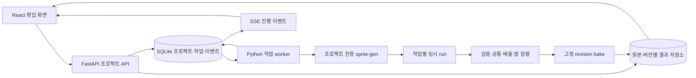

# 구현 구조와 Python 긴 작업 연결

상태: **구현 제안**. 웹앱, API 서버, 작업 큐, 프로젝트 포크를 이번 조사에서 구현·배포한 것은 아니다. 기존 엔진의 실행 검증과 제안 기능을 분리한다.

## 결정

로컬 1인 제작 도구의 첫 구현은 **React + Vite + TypeScript, FastAPI, 별도 Python worker, SQLite와 프로젝트 파일 저장소**를 권장한다. Python 엔진을 포크해 재사용한다. 프런트와 서버의 언어를 맞추기 위해 영상·알파·추출·큐레이션 전체를 TypeScript로 재작성할 근거는 없다.

| 판단 기준 | React + Vite | Next.js | 이 프로젝트 판단 |
|---|---|---|---|
| 편집 캔버스·재생·드래그·로컬 업로드 | 클라이언트 앱 중심, 빌드 후 정적 배포 가능 | 클라이언트 컴포넌트로 구현 가능 | 두 방식 모두 가능; SSR의 이득이 작음 |
| API 구성 | Python API 한 곳이 프로젝트와 작업의 주인 | Route Handler를 BFF로 둘 수 있음 | Python 엔진을 유지하므로 불필요한 이중 API 계층은 초기 생략 |
| 로컬 파일 접근 | 브라우저가 선택한 파일을 Python에 업로드, 서버가 허용 프로젝트 디렉터리 관리 | 서버 배치 위치에 따라 같음 | Next가 브라우저 임의 파일시스템 접근을 해결해주지는 않음 |
| 장시간 생성·CPU 처리 | 별도 worker와 동일 job API | 별도 worker와 동일 job API | 프레임워크와 무관하게 요청 수명에서 분리 |
| 배포 운영 | 빌드 산출물을 FastAPI가 함께 제공하면 로컬 실행 프로세스 단순 | Node 서버와 Python worker 운영 또는 정적 export 구조 필요 | 첫 MVP는 정적 UI+Python 한 API origin |
| 향후 계정·협업·SSR 콘텐츠 | 별도 인증/웹 서버 확장 필요 | 기존 Next 플랫폼/인증을 쓰는 팀에 유리 | 실제 원격 협업 요구가 생기면 재평가 |

공식 근거: [Vite Overview/React template](https://vite.dev/guide/), [Next Route Handlers](https://nextjs.org/docs/app/getting-started/route-handlers). 둘의 기능을 비교한 부분 외 비용·복잡도 판단은 위 로컬 요구에 대한 설계 추론이다. 버전은 구현 시 lockfile로 고정하며 현재 'latest'를 재현 기준으로 사용하지 않는다.

## 실행 모델



FastAPI `BackgroundTasks`만으로 긴 작업의 내구성을 해결하지 않는다. 공식 [Caveat](https://fastapi.tiangolo.com/tutorial/background-tasks/#caveat)도 무거운 연산의 별도 작업 도구를 언급한다. 로컬 MVP는 Redis/Celery를 즉시 요구하지 않고 SQLite 큐와 단일 dispatcher, 독립 자식 프로세스로 시작한다. 다중 호스트가 필요해지면 같은 Job 계약을 큐 제품으로 옮긴다.

- HTTP POST는 입력 검증·DB job 등록 후 `202 {jobId,eventUrl}` 반환. 이미지 처리를 응답 연결 안에서 기다리지 않는다.
- worker는 `argv` 배열과 고정 명령 adapter를 사용한다. 사용자가 입력한 문장을 shell로 평가하지 않는다. 프롬프트는 파일이나 구조화된 인자에 저장한다.
- fork `.venv/bin/python`만 사용하고 engine commit, package/env fingerprint, adapter version을 job에 저장한다. 공용 설치본을 import/write 대상으로 삼지 않는다.
- 같은 materialized run에는 writer 1개. 생성은 처음에는 병렬1을 기본으로 하고 engine 내부 fan-out을 외부 큐와 중복하지 않는다. 확장 시 provider별 동시성/개별 state lock 정책을 명시한다.
- 외부 이미지 생성은 정확한 퍼센트가 없으면 '생성 중 / 시작 후 경과 시간' 표시. 로컬 단계는 completed/total 프레임 수. stderr 문자열을 근거 없이 %로 변환하지 않는다.
- 진행 이벤트는 monotonic eventSeq로 저장하고 SSE `Last-Event-ID`로 재연결한다. 브라우저가 닫혀도 worker·저장은 계속되며 열면 GET job으로 현재 상태를 복원한다.

## 상태, 실패, 취소, 재시도

`queued → running → succeeded | needs_review | failed`가 기본이다. 취소는 `cancel_requested → canceled`이며 자식 종료와 결과 분리까지 확인한 후 canceled가 된다. 재시작 시 heartbeat가 끊긴 running은 `interrupted`, provider 결과가 불명확하면 `provider_outcome_unknown`으로 표시한다. 이 상태는 succeeded나 canceled의 동의어가 아니다.

1. 실행 전 immutable input snapshot, request hash, project revision, 선택 reference revision, engine commit을 기록한다.
2. `<jobId>/<attemptId>/work`에 stage별 checkpoint를 쓴다. 결과 PNG 파싱·개수·해시·alpha·manifest를 검증한 뒤 완료 marker를 기록한다.
3. 원본과 이전 승인 결과는 보존한다. 새 후보를 만들고 사용자의 채택 전까지 현재 클립을 바꾸지 않는다.
4. 취소 요청은 DB에 먼저 기록하고 실행 프로세스 그룹에 종료 요청을 보낸다. 잠시 후 미종료 자식을 정리하되 provider 서버에서 이미 접수된 호출은 취소되었다고 단정하지 않는다. local partial 파일은 격리하며 승인 결과에 포함하지 않는다.
5. worker 시작 시 lease 만료 job, temp 결과, receipt를 검사한다. 로컬 완료 stage는 입력 hash가 맞으면 재사용한다. provider timeout/끊김은 요청 ID와 결과 조회 기능이 있을 때만 reconcile하고, 상태를 알 수 없으면 자동 재전송하지 않는다.
6. 처리 재시도는 새 attemptId; 생성 재시도/부분 재생성은 새 generationVersionId. UI의 idempotency key로 더블클릭은 한 job으로 묶지만 외부 provider의 exactly-once를 보장한다고 표기하지 않는다.

UI 오류 응답은 `{code,stage,message,retryable,affectedIds,retainedArtifactIds,nextActions}`로 통일한다. 파일 경로/원시 traceback은 진단 펼침에서만 보여주며 일반 UI는 '배경 제거 / 3번 후보 / 다시 처리'처럼 행동을 안내한다.

## 포크 구조

기준은 [v2.12.1 commit b058341f7543f3adcbea227bd4e6b7587895b1bc](https://github.com/aldegad/sprite-gen/tree/b058341f7543f3adcbea227bd4e6b7587895b1bc). 실제 복제·원격 fork·PR은 아직 만들지 않았다. 세부 해시와 라이선스 확인은 [engine-audit.md](engine-audit.md).

```text
copy_spritegen/                    # 향후 제품 저장소; 현재는 연구 폴더
  research/                       # 현재 조사 보존
  apps/web/                       # React/Vite 화면, 프로젝트 API client
  services/api/                   # FastAPI schemas, assets, revisions, jobs
  services/worker/                # dispatcher, process runner, checkpoint/reconcile
  packages/contracts/             # OpenAPI/JSON Schema → TS types
  engine/sprite-gen/              # 전용 upstream fork checkout, 별도 .venv
    LICENSE / NOTICE / SKILL.md   # upstream 고지 보존
    sprite_gen/                  # 필요한 포크 변경만, upstream diff 관리
  adapters/spritegen/             # CLI 허용목록, frame mapping, stage results
  alignment/                     # shared scale / manual anchors / overflow gate
  tests/fixtures/                 # 배포권한 있는 fixture와 합성 실패 사례
  .data/projects/<projectId>/     # Git 제외, 사용자 선택 저장 폴더에도 가능
  .data/jobs/<jobId>/<attemptId>/  # 임시/검증 결과
  licenses/                      # 타사 고지와 에셋 출처
```

전용 fork repository를 submodule로 commit pin하면 upstream merge와 app 코드를 분리하기 쉽다. 초기 clone도 프로젝트 하위 디렉터리에만 둔다. Git 사용이 익숙하지 않은 사용자에게는 설치/업데이트 UI가 이 구조를 감춘다. 개발자는 engine lock에 upstream SHA·patch SHA·의존성 lock hash를 함께 기록한다. 릴리스마다 upstream test와 이 연구의 회귀 fixture를 돌리고 공용 `~/.codex/skills/sprite-gen`와 동기화하지 않는다.

Apache-2.0 `LICENSE`, `NOTICE`, 저작권 고지를 보존하고 수정 파일과 제품 고지에 변경 사실을 기록한다. 엔진 코드 라이선스가 공개 거너 이미지나 생성 provider 서비스 권한까지 포괄하지는 않는다. 조사 fixture는 제품 기본 에셋에서 분리한다.

## 재사용과 최소 포크 변경

| 구분 | 대상 | 구현 작업 |
|---|---|---|
| 유지 | prepare/gen/gen-set, chroma/cutout, component 검출, curation bake, atlas/export | 버전 고정 CLI adapter부터 시작하고 안정적 함수만 단위 호출 |
| 감싸기 | 기존 curation 저장·불러오기·candidate 인덱스, working base 편집 | 프로젝트 revision/immutable asset/안정 ID mapping, 저장 acknowledgement 확인 |
| 새 작성 | 기준 승인 UI, upload 비교, job runner, generation lineage, 수동 발점/공통배율, 오류 review | 상위 app 소유 |
| 포크 변경 | extract의 원시 crop 결과를 fit 이전에 반환, per-frame duration, clipping gate, saved revision 반환 | 작은 독립 변경으로 회귀테스트. cell별 확대 경로를 animation import와 분리 |
| 후순위 | 영상, 보간, 다방향, 원격 협업, 모바일 편집 | core import→export와 실제 provider row 경로 이후 |

## 원본·미리보기·출력 경계

업로드는 서버가 MIME/디코딩/크기 한도를 확인하고 SHA256으로 immutable 원본을 만든다. working base는 그 복사본이다. 편집마다 새로운 derived asset으로 저장하며 원본 변경 API는 제공하지 않는다. 파일 열기/가져오기/복원/다운로드는 전부 UI에서 가능해야 한다.

빠른 편집 preview와 최종 bake preview를 구분한다. 최종 승인 화면은 서버가 내보낼 **바로 그 baked PNG와 manifest**를 표시한다. atlas와 개별 PNG는 같은 baked frames에서 만들어 픽셀·좌표·순서를 교차 확인한다. 단순히 JS에서 비슷하게 transform한 화면을 보았다는 이유로 출력 일치를 선언하지 않는다.

local 서버는 loopback에 bind하고 app session token·허용 origin·프로젝트 경로 제한을 둔다. arbitrary path와 shell 입력은 UI/API 모두 받지 않는다. provider credential은 서버 연결 상태만 UI에 보내고 프로젝트 백업·로그에는 넣지 않는다. 공개 배포는 이번 범위 밖이다.
