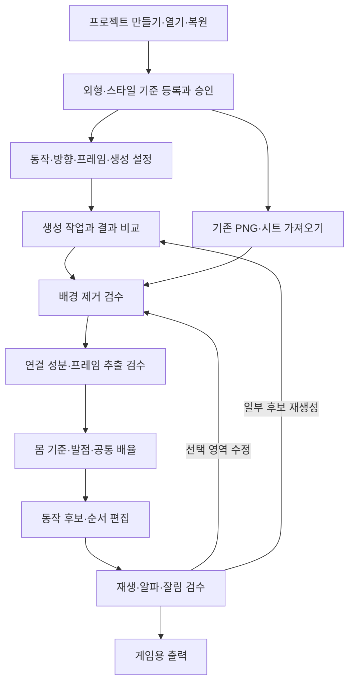

# 화면 흐름과 구성

이 문서의 화면은 새 앱의 구현 명세다. 실제 동작하는 React 앱 또는 원작 내부 UI 캡처가 아니다. 사용자에게 CLI/파일명/JSON 편집을 요구하지 않는 흐름을 완료 기준으로 삼는다.

화면 상단은 프로젝트/캐릭터/기준 revision/저장 상태, 왼쪽은 단계와 동작 목록, 중앙은 이미지·캔버스·비교, 오른쪽은 해당 단계 설정, 아래는 후보/순서/작업 상태를 둔다. 진행을 막는 오류는 해당 단계에 표시하고 기존 완료 단계로 자유롭게 돌아갈 수 있게 한다. 영어 CLI 명칭 대신 작업명으로 보여주고 진단 펼침에만 구현 경로를 둔다.

## 1. 프로젝트와 가져오기

첫 화면: `새 프로젝트`, `열기`, `백업에서 복원`, 최근 작업 카드. 이름, 저장 위치(폴더 선택), 캐릭터 이름, 기본 셀 크기를 받는다. 빈 상태에 `기준 이미지 등록`과 `완성 PNG 가져오기`를 동등한 진입점으로 제공한다. 기존 PNG 검증은 provider 연결 없이 완주할 수 있어야 한다.

업로드 drop zone은 PNG/WebP·지원 시트·완성 atlas+metadata를 구분한다. 다중 파일에는 썸네일, 순서, 크기, alpha 유무, 중복 hash, 경고를 보인다. 원본/투명 배경/밝음/어두움 비교를 즉시 제공한다. grid를 선택할 때 열/행을 UI로 입력하고 실제 분리선을 겹쳐 보여준다. 불명확한 grid는 연결 성분 모드나 수동 영역으로 전환한다. `정지 입상 키 맞추기`는 별도 명시 옵션이며 애니메이션 기본에서 숨겨진 자동 설정으로 쓰지 않는다.

## 2. 외형·스타일·자세 기준 승인

중앙에 `외형 기준`, `스타일 참조(선택)`, `자세 참고(선택)` 슬롯을 나란히 둔다. 원본 크기/확대/나란히/반투명 겹침 비교를 제공한다. 얼굴, 머리, 의상, 장비, 팔레트, 몸/머리 비율, 픽셀 표현, 방향을 유지 규칙으로 편집하고 허용 변경(관절/표정/포즈)을 따로 입력한다. 스타일 이미지의 장비를 복사하지 말아야 한다는 규칙도 저장한다.

기준 자세에서 머리 위/몸 기준 아래/접지점을 클릭해 몸 체고를 지정하고 선택 bbox와 구분한다. `승인`은 revision을 고정한다. 이후 자료 교체는 새 draft revision이며 기존 생성 결과의 기준을 소급 변경하지 않는다. 예전 revision과 새 revision 비교 후 재생성 범위를 선택한다. 승인 주체와 시간을 기록한다.

## 3. 동작·프레임·provider 설정

동작별 행: 이름, 방향, 목적/포즈 설명, 요청 프레임 수, 후보 수, 반복/단발, 기본fps, 기본 지속시간, 생성 품질/해상도, provider와 모델. 거너의6동작은 선택 가능한 템플릿이며8키포즈는 별도 pose library다. 사용자 숫자 요청과 provider가 실제로 만든 숫자를 나란히 표시한다.

provider 카드: 설치됨/로그인 필요/연결 확인됨/최근 생성 성공/제한 또는 실패/확인 불가를 분리한다. 로그인 감지 성공은 생성 가능·쿼터 충분의 보증이 아니다. 지원하지 않는 다중 참조나 크기 설정은 disabled 사유를 표시한다. provider 자동 유료 전환은 금지한다. 이 조사 중에는 모든 실제 provider 생성 미수행이다.

기본 프롬프트는 폼에서 구성하고 고급 텍스트 편집을 선택 제공하되 JSON은 요구하지 않는다. 참조별 역할과 승인 기준을 미리보기로 보여준다. 예상/미확인 비용 구분, 선택한 설정 요약 후 `생성`한다. 이 제품의 향후 비용 확인 UX와 이번 무호출 정책은 별개다.

## 4. 작업 센터와 생성 이력

작업 카드에 동작, 기준 revision, provider/model, 시작/경과 시간, 현재 단계, 완료 항목 수, 취소/재시도/결과 보기, 이력 비교를 둔다. 로그는 사용자용 요약을 기본으로 한다. provider 요청 시간이 길 때 임의 90%에서 멈춰 있지 않게 한다.

후보 카드에는 승인 원본과 비교 버튼, 생성 version, 요청/실제 프레임 수, 방향 관찰, source history를 둔다. `선택 후보 다시 생성`은 현재 승인 후보를 유지하며 새 후보를 추가한다. 이미 성공한 다른 동작은 건드리지 않는다. 재시작하면 실패 stage와 재사용 가능한 결과를 보여주며 결과 불명 provider 작업은 수동 확인 상태로 남긴다.

## 5. 배경 제거와 성분 편집

원본/처리 결과 slider와 alpha-only 토글, 밝음·어두움·색 배경을 둔다. 배경색 자동/수동, 임계값, 가장자리 정리, 내부 구멍 보존, brush 복구/삭제는 엔진의 실제 지원 범위에 맞춰 노출한다. 자동 제거가 불확실하면 `검수 필요`로 남기고 투명 체크무늬만 보고 승인하지 않는다.

추출 화면은 sheet 위 component 번호와 bounding polygon/rectangle, 예상 프레임 수, 분리된 소품을 보여준다. 클릭으로 component를 같은 프레임으로 합치고 접촉한 포즈는 분리선을 지정한다. 잘린 무기는 다음 단계의 확대/정렬로 복원할 수 없으므로 원본 영역/추출/재생성으로 돌아간다. 합치기/분리와 mask는 원본이 아닌 revision 편집이다.

## 6. 정렬

512/18/2는 `거너 예시` 프리셋으로 제공한다. 셀, 가장자리, 바닥 여백, 목표 발점, 승인 몸 체고, 목표 몸 체고, 계산된 공통 배율, 보간법을 명시한다. 기본은 같은 캐릭터·방향·승인 기준의 그룹 배율 잠금이다.

캔버스에는 원본 alpha bbox, 몸 기준선, 자동 발점 후보, 확정 발점, 목표 바닥선, overflow 경고를 서로 다른 표시로 겹친다. 수동 발점 드래그/키보드1px 이동/숫자 입력을 제공한다. `접지`, `공중`, `확인 필요`와 사용한 발 ROI를 기록한다. 공중 프레임을 바닥으로 강제 붙이지 않는다. 무기 끝/망토가 하단 밴드에 들어오면 자동값을 확정하지 않는다.

overflow에서는 `셀 키우기`, `그룹 전체 축소`, `분리 영역 수정` 선택을 제공한다. 프레임 하나만 자동 축소하거나 음수 paste로 잘라내지 않는다. 0.85 gate는 거너 호환 옵션의 규칙이며 모든 캐릭터 공통 제한이 아니다. authored offset은 의도된 반동·점프와 자동 정렬을 분리해 표시한다.

## 7. 후보·재생 순서 편집

위쪽 후보 풀과 아래쪽 실제 재생 순서를 분리한다. 선택/제외/순서 변경/복제/앞뒤 추가/대체/되돌리기를 제공한다. 같은 후보의 여러 occurrence가 서로 다른 지속시간과 offset을 가질 수 있다. 엔진의 중복 index 제거 규칙 때문에 UI의 반복 사용을 단순 중복 selected index로 저장하면 안 된다. adapter가 clone 또는 고유 occurrence로 바꾼다.

기존 curation은 버전 고정 모듈/adapter로 재사용한다. 독립 iframe을 띄워 사용자가 두 군데 저장해야 하는 방식은 완료가 아니다. 단계적으로 기존 UI를 내장할 때도 단일 저장·현재 revision·상태 변경 이벤트를 연결하고, 노출되지 않은 기존 조작이 bake 결과에만 남지 않게 한다. 빈 타임라인은 그대로 비어 있다고 표시하고 출력 차단한다. 엔진의 `selected:[]`가 전체 기본 선택으로 해석되는 동작을 사용자에게 전가하지 않는다.

## 8. 재생 검수와 팀 아웃라인

실제 표시 크기(예128px), 확대, 이전/다음 onion skin, 속도, 한 프레임 이동, 반복/단발(마지막 유지 또는 초기 복귀), 배경 비교를 제공한다. QA는 `확인됨 / 검수 필요 / 차단`과 근거 이미지를 구분하며 외형 일관성을 자동 보증하지 않는다.

팀색·두께 단위·복제 opacity·4/8방향·preview-only/baked를 선택한다. 원본 alpha를 유지하고 합성 뒤 셀 경계를 다시 검사한다. 원작1.65/0.48 값은 비교 preset이고 픽셀 정수 두께에만 맞춘 우리 renderer의 결과를 원작과 완전 동일하다고 주장하지 않는다.

## 9. 출력과 저장·복원

출력 폼: 이름, 대상 형식(개별PNG/atlas+runtime manifest/Aseprite 호환 JSON), 셀/여백/packing, alpha, 기본fps/개별시간 요약, loop, outline bake. `검사 후 출력`은 현재 저장 revision을 서버에서 승인받고 immutable export snapshot을 만든다. 출력 결과 카드의 미리보기는 저장된 artifact를 다시 읽어 보여준다.

zip 다운로드, 저장 위치 열기, 프로젝트 전체 백업, JSON 없이 복원 UI를 제공한다. 백업에는 원본·참조·생성 이력·frame mapping·편집·버전·타이밍·필요 산출물을 포함하고 credentials는 제외한다. missing file/hash 오류는 목록과 재연결 버튼으로 복구한다. 자동 저장 실패는 빨간 상태로 고정하며 출력 버튼이 실패한 저장을 무시하고 진행할 수 없다.

모든 핵심 드래그 동작에 버튼/키보드 대체 수단, 필드 label, focus 복귀, 저장 성공 알림, unsaved 변경 표시를 제공한다. 탭을 닫는 행위가 서버 생성 취소라고 오인되지 않게 작업 상태를 안내한다.
