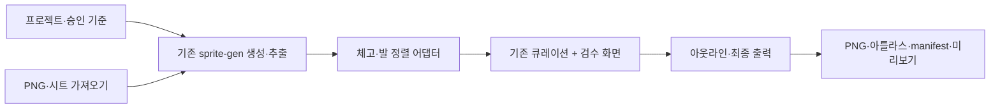

# 하이브리드 캐릭터 스프라이트 제작기 구현 명세

상태: 설계안. 용사주식회사 내부 구현을 확인한 소스코드 명세가 아니다.

## 1. 목표와 첫 사용 흐름

한 캐릭터의 승인 원본을 등록하고, 필요한 동작의 후보 프레임을 생성하거나 가져온 뒤, 외형·배율·발 위치를 검수하여 게임에 바로 읽힐 PNG와 메타데이터를 내보낸다.

1. 프로젝트 생성 → 외형 원본/스타일 참조를 별도로 등록한다.
2. 고정할 얼굴·의상·무기·색·방향·몸 비율을 기록하고 기준 버전을 승인한다.
3. 기존 PNG/시트를 가져오거나 상태별 이미지 생성을 실행한다.
4. 배경 제거 결과와 연결 성분을 검수한다. 잘린 무기나 분리된 장비는 사람이 병합/분리할 수 있다.
5. 대기 기준 자세에서 몸 체고와 발 앵커를 정하고 공통 배율을 잠근다.
6. 후보 풀에서 각 동작의 순서를 구성한다. 일부 프레임만 재생성·교체할 수 있다.
7. 실제 표시 크기, 확대, 이전/다음 프레임 겹침, 여러 배경에서 확인한다.
8. 검사 후 아틀라스, 개별 PNG, 재생/좌표 메타데이터, 미리보기를 저장한다.

8개 키포즈와 6개 동작은 거너 프리셋으로 제공하되 임의 캐릭터에 강제하지 않는다.

## 2. 화면별 책임

| 화면/영역 | 주요 기능 | 완료 기준 |
| --- | --- | --- |
| 프로젝트 | 캐릭터 생성·열기·복제·로컬 저장 | 재시작 후 동일 상태 복구 |
| 기준 자료 | 외형/스타일 참조, 승인 버전, 유지/변경 규칙 | 재생성 요청이 승인 버전을 명시적으로 참조 |
| 동작 보드 | 상태별 후보 풀/재생 순서, 선택·복제·순서·반복 | 선택 결과가 저장·미리보기·출력에서 동일 |
| 정렬 | 원본/알파 영역, 발 앵커, 몸 체고, 공통 배율, 이동값 | 웅크림 크기 보존, 무기 길이에 따른 몸 중심 흔들림 방지 |
| 픽셀/알파 보정 | 기존 엔진의 편집 기능 재사용, 배경 검사 | 흰 테두리·잔여 배경을 여러 배경에서 확인 |
| 재생/검사 | FPS, 프레임 이동, 반복, 실제 표시 크기, 겹침 비교 | 루프/단발 구분, 발/몸/장비 변화 검수 |
| 아웃라인 | 팀 색, 두께, 불투명도, 4/8방향 | 원래 알파 보존, 아웃라인이 배경 결함을 숨기지 않음 |
| 출력 | PNG·아틀라스·JSON·미리보기 | 별도 뷰어에서 저장한 파일만으로 같은 동작 재생 |

## 3. 엔진 결합 방식

사용자 요구에 따라 `sprite-gen`을 포크하고 React 또는 Next.js 웹앱으로 전체 제작 과정을 연결한다. 큐레이션 앞의 명령어 작업을 모두 UI에서 수행할 수 있어야 한다. 기존 Python 처리 코드를 유지하고 화면·작업 관리 계층을 추가한다.

로컬 제작 도구의 첫 후보는 React + Vite와 Python API/작업 실행기다. Next.js가 필요한 기존 배포 환경이나 인증 요구가 있으면 Next.js를 선택하되, 긴 이미지 처리 작업은 별도 Python 작업 실행기에서 수행한다. 프런트엔드 선택은 조사 후 근거와 함께 확정한다.

포크 기준 커밋과 Apache-2.0 라이선스·기존 고지를 보존한다. 초기에는 프로젝트 안에 독립 소스 사본을 마련할 수 있으며, 원격 GitHub 포크·게시 여부는 로컬 구현과 구분해 보고한다. 실제 포크와 애플리케이션 구현은 아직 시작하지 않았다.

### 명령어 작업의 UI 전환

| 사용자 화면 | 기존 처리 연결 | UI에서 제공할 값/상태 |
| --- | --- | --- |
| 새 캐릭터 / 기준 이미지 | `prepare`, 참조 파일 등록 | 외형·스타일 참조, 이름, 방향, 고정 특징, 승인 버전 |
| 생성 설정 | `gen`, `gen-set` | 사용 가능한 provider, 프롬프트, 동작, 프레임 수, 생성 실행 |
| 생성 작업 | 작업 실행기 | 대기·실행·완료·실패, 로그 요약, 취소, 실패 단계 재시도 |
| 시트·이미지 가져오기 | 기존 가져오기·분리 명령 | 원본/알파 미리보기, 후보 프레임, 잘린 장비 검수 |
| 배경 제거·프레임 추출 | `cutout`, `extract` | 처리 전후 비교, 분리 결과, 다시 처리할 범위 |
| 체형·발 정렬 | 새 정렬 어댑터 | 공통 배율, 몸 체고, 자동/수동 앵커, 셀 초과 경고 |
| 후보 선택·동작 편집 | 기존 큐레이션 로직 | 상태별 후보·순서·반복·변형, 저장·되돌리기 |
| 출력 | 기존 bake·export 명령 | 형식·크기·FPS·루프, 검증 결과, 파일 다운로드 |

사용자가 터미널에서 명령어를 입력하거나 중간 JSON을 직접 수정해야 하면 전체 UI화 완료로 보지 않는다. 서버는 허용한 작업과 검증된 인자만 실행하고 임의 셸 명령 입력 기능을 제공하지 않는다. 큐레이션은 초기에 기존 UI를 통합할 수 있지만 프로젝트·선택·출력 상태가 하나로 이어져야 한다.



- Python 엔진은 CLI/명시적 API 어댑터로 호출한다. 설치된 전역 스킬 파일을 이 프로젝트 요구사항으로 직접 고치지 않는다.
- 작업마다 독립 run 폴더를 사용한다. 동일 run에 두 프로세스가 쓰지 않게 한다.
- 기존 `request.json`, `curation.json`, `manifest.json` 계약을 재사용하고 새 승인 기준/정렬 정보는 별도 sidecar로 둔다.
- 실제 최종 파일은 현재 큐레이션을 bake한 출력에서 취한다. 처리 중간 `frames/`를 그대로 게임에 복사하지 않는다.
- 서버는 로컬 작업용으로 시작한다. 생성 작업은 진행률·실패·취소 상태를 표시한다.
- 생성 provider는 사용 가능한 기존 연결을 사용한다. 로그인 UI가 있다는 이유만으로 제3자 모델 호출 권한을 가정하지 않는다. 임의의 유료 API로 자동 전환하지 않는다.

## 4. 정렬 규칙

### 기본 규칙

- `approvedBodyHeight`는 머리/몸의 일관성을 판단하는 기준이며 무기·깃털 포함 bbox 높이와 다르다.
- `sharedScale = targetBodyHeight / approvedBodyHeight`를 같은 캐릭터/방향의 관련 포즈에 적용한다.
- 웅크림·피격·도약의 bbox를 대기 높이로 확대하지 않는다.
- 자동 발 추정은 아래쪽 알파 밴드의 중간값 후보다. 무기·망토·다중 접지점·공중 자세에서는 수동 지정하거나 미확인으로 남긴다.
- 원본 좌표계의 앵커와 출력 셀의 목표 앵커를 구분한다.
- `placement = targetAnchor - sharedScale * sourceAnchor + authoredOffset`.
- 최근접 리샘플링을 기본으로 검증한다. 반전은 장비 좌우가 달라질 수 있어 자동 보정하지 않는다.

### 셀 초과

공개 거너의 512/18/2/0.85 값은 선택형 프리셋으로 제공한다. 기본 정책은 초과 프레임을 표시하고 셀 확장 또는 캐릭터 전체 공통 축소를 선택하도록 하는 것이다. 특정 프레임만 몰래 줄이면 머리 크기가 달라진다.

거너의 포즈별 안전 축소를 재현하는 호환 모드는 별도로 표시하고, 기준 배율에서 얼마나 달라졌는지 보인다. 0.85 미만은 원본/분리 영역 재검토로 돌린다. 외형 보존과 셀 맞춤의 충돌을 자동으로 숨기지 않는다.

### 아웃라인

원본 RGB/알파를 유지한 채 팀 색 실루엣을 뒤에 합성하는 옵션을 제공한다. 미리보기 전용과 PNG bake를 분리한다. 두께가 원본 픽셀 기준인지 실제 표시 크기 기준인지 명시하고, 양쪽 결과를 별도로 검증한다.

## 5. 추가 저장 형식 — 제안

다음 필드는 새 도구의 설계안이며 원본 사이트에서 추출한 계약이 아니다.

```json
{
  "schemaVersion": 1,
  "characterId": "sample-knight",
  "approvedReference": {
    "revision": "ref-1",
    "identityImage": "references/identity.png",
    "styleImage": "references/style.png",
    "fixedTraits": ["얼굴", "갑옷", "검", "색상"],
    "facing": "right"
  },
  "alignment": {
    "mode": "shared-scale-foot-anchor",
    "approvedBodyHeight": 300,
    "targetBodyHeight": 240,
    "cell": [512, 512],
    "targetAnchor": [256, 494],
    "footBandRatio": 0.12,
    "alphaThreshold": 16,
    "overflowPolicy": "review"
  },
  "frames": {
    "idle-0": {
      "source": "raw/idle-0.png",
      "sourceAnchor": [150, 300],
      "anchorMethod": "manual",
      "offset": [0, 0],
      "review": "approved"
    }
  }
}
```

예시 수치 300/240은 새 도구의 설계 예시이며 원작의 내부 수치가 아니다.

실제 구현에서는 엔진의 안정적인 프레임 ID와 생성 버전에 연결한다. 재생성으로 같은 인덱스의 이미지가 바뀌면 이전 보정값을 무조건 적용하지 않는다.

## 6. MVP 구현 순서

### A. 기존 이미지로 편집·출력 완성

같은 캐릭터의 서기·웅크리기·긴 무기를 든 자세를 독립적인 테스트 소재로 준비한다. 가져오기, 알파 검사, 공통 배율, 수동 앵커, 후보/순서, 미리보기, JSON/PNG 출력을 구현한다. 첫 품질 검증은 AI 생성 품질에 의존하지 않는다.

### B. 생성 앞단 UI 연결

기준 이미지 등록, 승인 규칙, provider 선택, 동작별 프롬프트·프레임 수 설정을 웹 UI로 제공한다. 생성 작업을 시작하고 결과를 후보 풀에 추가한다. 승인 원본은 보존하고 진행 상태·실패 원인·취소·단계별 재시도를 표시한다. 터미널 입력 없이 전체 과정을 검증한다.

### C. 게임용 마무리

팀 색 아웃라인, 알파/잘림/앵커 경고, 게임용 출력을 추가한다. 여러 방향, 영상 기반 프레임, 보간은 이후 확장 대상으로 둔다.

## 7. 수용 테스트

| ID | 입력/작업 | 통과 조건 |
| --- | --- | --- |
| A1 | 서기 471px, 웅크림 320px에 같은 배율 적용 | 높이 비율 약 0.679 보존. 웅크림만 471px로 커지지 않음 |
| A2 | 한쪽으로 긴 무기 | 무기 bbox 중심이 바뀌어도 지정한 몸/발 앵커 유지 |
| A3 | 아래로 늘어진 망토, 공중 자세 | 잘못된 발 위치를 확정하지 않고 수동 검수 가능 |
| A4 | 셀 경계를 넘는 무기 | 무조건 자르지 않고 분리·병합 결과 확인 가능 |
| A5 | 체크무늬가 그려진 불투명 PNG | 실제 알파로 배경을 식별하고 투명으로 오인하지 않음 |
| A6 | 후보 삭제·순서·복제·이동·저장·재시작 | 선택과 변형 복원, 원본 해시 불변 |
| A7 | 한 프레임만 재생성 | 다른 승인 상태와 보정 보존, 생성 버전 불일치 표시 |
| A8 | 미리보기와 출력 비교 | 위치·색·알파·순서 일치 |
| A9 | 단발 공격과 반복 대기 | FPS·프레임 지속 시간·반복 설정이 manifest에 저장 |
| A10 | 손상된 PNG/JSON, 누락된 참조 | 원본을 보존하고 실패 위치 표시 |
| A11 | 셀 초과 또는 빈 알파 | 조용히 자르거나 빈 파일을 만들지 않고 오류 표시 |
| A12 | 실제 작은 표시 크기와 여러 배경 | 몸·무기·팀 윤곽 검수 가능 |
| A13 | 새 프로젝트부터 생성·추출·편집·출력 | 터미널/JSON 수동 편집 없이 웹 UI에서 완주 |
| A14 | 생성 실패·취소·재시작 | 성공한 단계와 원본 보존, 실행 상태 복원 및 재시도 가능 |

## 8. MVP 제외 범위

PXF 생성·노드 그래프·FX 커뮤니티, 배경 생성, 전투 엔진, 멀티플레이, 클라우드 공개는 첫 MVP에 포함하지 않는다. 기존 `effect_editer` 프로젝트는 변경하지 않는다.
